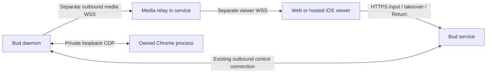

# Design: interactive browser streaming with outbound connectivity

Status: **Proposal, no implementation selected.** September 27, 2026.

Reviewed Bud `b9400bb` and the mobile handoff at `b9ea713`, after the September
28 UTC phone tests. This expands [Phase 5](../plan/bud-owned-browser/phase-5-webrtc-media.md)
with four alternatives. Further tuning of the existing screenshot scroll loop
remains paused. Passive viewing and the agent REPL remain useful and supported.

## Recommendation

Keep the daemon's existing outbound control connection. It does not determine
the transport used for interactive media.

First run a bounded **CDP screencast over dedicated WSS** experiment (proposal A)
to establish whether Chrome can produce timely, isolated frames without holding
the input lock. Compare **encoded video over WSS** (B) against **WebRTC video
with TURN fallback** (C) only after that capture gate. B is the preferred candidate
if preserving today's HTTP/WSS network requirements is the deciding constraint;
C is the preferred candidate if measured cellular/loss behavior warrants a new
media transport. The hybrid gateway (D) is a conditional alternative, not a step
we must build on the way to C.

This is a recommendation for the experiment order, not a promise that screencast
will fix scrolling. Do not implement four production transports or restart a
long screenshot-quality tuning effort. Select one interactive path from evidence.

The [Proposal A experiment plan](../plan/browser-streaming/README.md) now scopes
the selected first investigation: local capture/provenance gates, bounded binary
WSS integration with existing HTTP input, and physical-device measurements.
Implementation is pending; no production transport has been selected.

Two distinctions drive the comparison:

- **CDP screencast is still a stream of compressed images.** It changes how
  Chrome produces frames, but does not itself provide H.264/VP8 video, WebRTC,
  congestion control, or native iOS scrolling.
- **TURN can preserve outbound-only installation.** Neither device needs an
  administrator to forward an inbound port. However, TURN/TLS on port 443 is
  not HTTPS, so it is not equivalent to WSS through every enterprise proxy.

The first distinction follows the [CDP protocol definitions](https://raw.githubusercontent.com/ChromeDevTools/devtools-protocol/master/json/browser_protocol.json);
the second follows [WebRTC's transport requirements](https://www.rfc-editor.org/rfc/rfc8835.html#section-3.4).

## Current system and observed constraints

### The media socket is already separate



Both public WebSocket connections are initiated by their respective clients.
The arrows for media indicate frame flow, not an inbound connection to the Bud.
Images are not carried on the terminal/agent command socket, in chat SSE, or in
the database. The media relay currently shares the service process and host,
so CPU, memory, bandwidth and service restarts are still shared costs.

Evidence from the current implementation:

| Area | Current behavior | Consequence for this work |
|---|---|---|
| Capture | [Daemon media loop](../bud/src/browser/media.rs) requests screenshots under the shared page lock; minimum 100 ms between capture starts | Ten captures/sec is a ceiling, not achieved frame rate. Encoding and lock waits consume the budget |
| Delivery | [Service relay](../service/src/browser/media.ts) requests another frame when downstream credit permits; [canvas](../web/src/features/browser/media.ts) ACKs after decode/draw | For a single viewer, the next capture depends on a network feedback round trip. There is bounded memory, but no continuous video pipeline |
| Encoding | Base64 PNG/JPEG in JSON; density retries may capture twice; motion selects lower-cost JPEG briefly | Replacing WSS alone leaves capture, repeat encoding and decode costs intact |
| Input | Serialized HTTP requests; [control coordinator](../service/src/browser/control.ts) authorizes/prepares each operation, dispatching through the daemon command carrier with a five-second deadline | A new socket does not remove per-operation coordination or Chrome stalls automatically |
| Local CDP | [CDP client](../bud/src/browser/cdp.rs) is serial and discards unsolicited events in its command loop; a separate inventory subscription already exists | Screencast needs a dedicated event reader/ACK path; it is not a one-line replacement of `captureScreenshot` |
| Authority | [Service](../service/src/browser/browser.spec.md) and [daemon](../bud/src/browser/browser.spec.md) enforce one private controller across the Bud's shared browser | A direct media/input path must retain daemon-side revocation, target ownership and private-output fences |
| Viewer | Shared hosted web renderer inside WKWebView; [M4](../web/src/features/browser/browser.spec.md#request-driven-geometry--m4) sizes from the requesting client and makes later Fit explicit | Preserve one page state and coordinate system. A second device must not repeatedly resize the first one's page |
| Runtime | One managed Chrome profile/process per Bud, separate thread tab workspaces; current persistent runtime requires macOS secure storage | Capturing a whole window or desktop can expose other workspaces. Linux display/secure-store readiness remains separate work |

The [scroll investigation](../debug/mobile-browser-scroll-distance.md) records
five-second uncertain inputs: capture waited behind the input operation, not
the reverse. The method that stalled remains unconfirmed; cancellation diagnostics
were added, not a fix for that stall. Later user-provided logs show successful
captures taking about 350–535 ms and input lock waits of 289–433 ms. One later
stream delivered 84 frames in about 70 seconds. These are individual samples,
not latency percentiles, and the later run does not prove the earlier failure gone.

For one viewer, the present frame cycle includes capture, both relay legs,
decode/draw, and ACK/demand travel back. Input-to-visible delay additionally
includes input queuing and Chrome processing. We need stage measurements rather
than attributing all of that delay to WebSocket overhead.

### Product requirements to preserve

1. Bud works on a remote machine without opening inbound ports or configuring
   its router. Record additional outbound destinations/protocols explicitly.
   WSS also needs a permitted endpoint/proxy configuration; it is not universal.
2. Control the **same live owned tab** the agent used, with the same sign-ins,
   forms and navigation state. Opening its URL in Safari is not takeover.
3. Work with minimized/background Chrome on macOS. Do not require a person at
   the Bud to select a screen-sharing source every time. Investigate unattended
   Linux separately; there is no assumption of a monitor or hardware encoder.
4. Preserve private control, explicit Return and durable agent continuation.
   Loss of connectivity stops input without silently returning private work.
5. Keep passive observation inexpensive and operation-driven. Do not start a
   continuous encoder merely because a thread or static preview is open.
6. Validate physical iPhone/WK playback, software keyboard/composition, text
   readability, touch targeting and background/resume. Smooth video alone does
   not supply native scroll physics or make a remote page accessible to VoiceOver.
7. Bound memory, queued work and frame age alongside terminal/file traffic.
   Keep the add-on opt-in; explicitly account for any encoder/helper dependency.

## What TURN changes about connectivity

STUN discovers reachable addresses; ICE tests candidate paths; TURN supplies a
relay allocation when a direct path is unavailable. A daemon behind NAT can
initiate its TURN connection, as can the phone. No static public address or
inbound port mapping is required on either customer device. Public relay
listeners and relay ports are infrastructure we or a provider must operate.
[WebRTC TURN guide](https://webrtc.org/getting-started/turn-server).

WebRTC supports TURN over UDP, TCP and TLS/TCP; TCP/TLS handles networks that
block UDP. HTTP proxy support is implementation-dependent. Our inference is
that an allowlist or proxy accepting only HTTPS/WSS can still reject TURN/TLS,
including on 443. Choosing that port does not turn TURN into an HTTP request.
[RFC 8835 §3.4](https://www.rfc-editor.org/rfc/rfc8835.html#section-3.4).

| Network condition | WSS media | WebRTC + appropriately configured TURN |
|---|---|---|
| Ordinary home NAT / cellular NAT | Outbound relay connections | Direct candidates or outbound relay connections |
| UDP blocked, outbound TLS to relay permitted | TCP path remains available | TURN/TLS may work; verify the actual endpoint stack |
| Only Bud's HTTPS/WSS origin allowed | Fits the existing destination/protocol policy if served there | Separate TURN endpoint/protocol may be blocked |
| Explicit authenticated HTTP proxy | Verify daemon proxy support; current success is the useful baseline | Verify both peers' proxy support; do not infer it from working signaling |
| Lossy mobile connection | TCP retransmission can delay newer frames behind older bytes | UDP media can avoid waiting for every obsolete packet; TCP relay loses part of this benefit |

The final row is a transport tradeoff, not a measured Bud performance result.
WebRTC's media stack supplies feedback and congestion mechanisms that a custom
WSS video stream would otherwise need to implement.
[WebRTC media transport](https://www.rfc-editor.org/rfc/rfc8834.html).

## Capture is a shared feasibility gate

Network transport cannot manufacture timely frames. Investigate these sources
before selecting an encoder or relay vendor:

| Source | Why examine it | Gate / limitation |
|---|---|---|
| `Page.startScreencast` | Target-scoped frame events and ACKs; starts from our owned CDP connection | Experimental compressed PNG/JPEG, not inter-frame video. Prove cadence, minimized behavior and metadata on the installed Chrome version |
| CDP video recording APIs | Current tip-of-tree also defines experimental `startScreenRecording` / `stopScreenRecording` with an IO stream | Check installed protocol and whether incremental output is suitable for live low-latency decoding; a recording API is not a proven streaming source |
| Chrome tab capture to a media track | Could use Chrome's media pipeline without screenshot decode/re-encode | The documented extension API requires invocation by the user; remote takeover in Bud is not automatically that gesture. Establish supported unattended startup and target selection |
| Platform/window or virtual-display capture | Can feed an encoder without repeated screenshot requests | Platform permissions, minimized behavior, browser chrome and other tabs complicate isolation; it is not equivalent to a per-tab source |

CDP details above are from the [current protocol schema](https://raw.githubusercontent.com/ChromeDevTools/devtools-protocol/master/json/browser_protocol.json),
not a claim that the packaged Chrome supports every new option.
Chrome documents the [tabCapture invocation requirement](https://developer.chrome.com/docs/extensions/reference/api/tabCapture).
The web [Screen Capture specification](https://www.w3.org/TR/screen-capture/#dom-mediadevices-getdisplaymedia)
requires transient activation and source selection and does not persist a grant
for unattended reuse. Calling `getDisplayMedia()` on the phone would capture the
phone's display, not the Bud's Chrome.

For B/C/D, a pragmatic prototype can decode screencast images locally and feed
a low-latency video encoder. Count that extra decode/encode cost explicitly;
it does not establish an efficient final capture design. A software encoder is
possible but needs CPU measurements; hardware acceleration is not assumed.
Do not disable Chrome's sandbox or broaden capture to the desktop to pass a test.

## Proposal A — CDP screencast over dedicated binary WSS

```text
owned tab → CDP image events → daemon → WSS relay → WSS → canvas
input    ← guarded daemon dispatcher ← authorized input WSS ← viewer
```

Replace the per-frame screenshot RPC cycle for private interaction with a
dedicated target event subscription. Decode CDP base64 locally and send binary
image bytes plus a bounded metadata envelope over the separate media sockets.
Keep at most the newest unsent image and small explicit byte/age limits.

ACK CDP on local bounded acceptance/discard, separately from network viewer
feedback. Network credit should bound a small in-flight byte window rather than
require a full viewer round trip before every new capture. Never hold the page
lock while awaiting the phone's ACK or encoding
and transmitting an image. Begin/end/target/resize operations still cross an
authority barrier; each delivered frame must have proven generation metadata.
Budget capture rate when discarding frames so a slow viewer cannot burn host CPU.

Initially measure existing HTTP input to isolate capture gains. Then compare an
authorized persistent input WSS path with the same bounded typed gestures and
daemon checks. Keep high-rate input separate from queued media bytes; authority
changes still use the existing service coordinator. Simply putting the current
HTTP handler behind a socket would retain its serialization and database costs.

**Benefits:** least change to the existing renderer and packaging; same outward
WSS model; no media codec or TURN infrastructure. Determines whether the serial
capture/credit design, rather than transport, is the principal bottleneck.

**Costs:** independent images use substantial bandwidth; TCP delivery still
waits for earlier bytes. Dropping an unsent image cannot retract bytes already
in a TCP socket. Slow links need admission control and stream reset on excessive
age, not an unbounded queue. Minimized screencast behavior is unproven.

**Use it if:** the bounded spike achieves acceptable phone interaction and
bandwidth. Otherwise retain the evidence and move to video; do not keep tuning
image quality indefinitely. This is a useful baseline even if it is not selected.

## Proposal B — encoded video over WSS, decoded with WebCodecs

```text
owned tab → local capture/encoder → binary WSS relay → WSS → WebCodecs → canvas
input    ← guarded daemon dispatcher ← separate authorized WSS ← viewer
```

Produce a low-latency inter-frame video stream on the Bud, initially testing
H.264 with a compatible decoder configuration. Relay encoded chunks without
transcoding. Send codec configuration, timestamps, dimensions and generation
metadata explicitly. Use bounded encode/decode queues, feedback-driven bitrate
and resolution, and a defined keyframe/resynchronization protocol.

Unlike independent images, arbitrary video chunks cannot all be replaced by the
latest chunk: later frames may depend on earlier ones. On overload, drop work
before encoding where possible, or discard a dependent sequence and request a
new keyframe. Reset decoder state across privacy/target/viewport transitions.

WebCodecs exposes codec processing rather than a complete network player, and
does not mandate a particular codec. Probe the actual configuration with
`VideoDecoder.isConfigSupported` and measure it in WK, not just desktop Chrome.
[WebCodecs specification](https://www.w3.org/TR/webcodecs/).
WebKit documents video WebCodecs support beginning in Safari 16.4; that is a
feasibility signal, not acceptance of our app or codec settings.
[WebKit release notes](https://webkit.org/blog/14787/webkit-features-in-safari-17-2/#webcodecs).

**Benefits:** preserves HTTP/WSS egress and existing proxy routing while gaining
video compression. A media gateway can be separated operationally without
changing the daemon's control transport. Same shared web/WK renderer is plausible.

**Costs:** we own adaptation, timestamps, keyframe recovery, queue limits and
decoder lifecycle. TCP can still turn loss into visible stalls. Local capture
and encoder packaging may be the largest implementation task. Text/chroma
readability and battery cost need measurement at mobile sizes.

**Use it if:** WSS-equivalent network access is a priority and the loss tests
meet the interaction target. This is the strongest alternative to adopting TURN
as a requirement, not merely a compatibility fallback for old clients.

## Proposal C — WebRTC video with direct ICE and TURN fallback

```text
signaling / authority: daemon ↔ existing Bud service ↔ authenticated viewer
media / input:        daemon media endpoint ↔ direct or TURN path ↔ viewer
```

A local media component supplies encoded video to a WebRTC stack, or supplies
raw frames to a stack that owns encoding. The hosted viewer receives video and
uses a data channel for typed input/ACKs. Signaling travels over Bud's authorized
service connection; the existing daemon connection remains required for authority.
The daemon needs a real WebRTC endpoint: Chrome's loopback CDP connection is not
one, and a TURN server does not turn screenshot events into an RTP video track.

Start with a managed or isolated test TURN service supporting UDP and TLS/TCP;
compare direct and forced-relay operation. Self-hosting versus managed relay is
an operational choice after the experiment, not a different browser API. Use
short-lived relay credentials, but bind control grants independently to the
specific peer, owner, workspace, controller and epoch.

**Benefits:** purpose-built interactive media transport; native video playback,
media feedback and adaptation; a direct path can avoid the service detour and
its media egress. TURN preserves operation behind NAT without customer port setup.

**Costs:** local capture/encoding plus a WebRTC runtime, signaling, ICE/TURN
operations, diagnostics and reconnection. Corporate policy may permit Bud WSS
yet deny this transport. TURN/TCP can still stall on retransmissions. Private
revocation now has to work when the service cannot inspect each media/input packet.
Video and separately delivered metadata need a proven displayed-frame association.

**Use it if:** capture is sound, physical iPhone behavior is better under loss,
and the tested network coverage is acceptable. If an HTTPS-only environment must
also support interactive control, an additional WSS path is a concrete product
requirement, with a real maintenance cost; do not assume TURN provides it.

## Proposal D — outbound WSS upload to a WebRTC media gateway

```text
owned tab → local encoder → outbound WSS → media gateway → WebRTC → viewer
input    ← guarded dispatcher ← input WSS ← gateway ← data channel ← viewer
```

Keep the Bud-side network requirements close to today. A dedicated gateway
accepts encoded chunks and maps them into an outgoing WebRTC track. It relays
typed input back through an authenticated bounded channel. The Bud service
continues to own admission and leases. Prefer matching codec configurations and
packetization without re-encoding; otherwise price and measure transcoding.

This gateway is **not TURN**: it terminates the media session and originates
another one. A standard SFU is not automatically an arbitrary WSS-chunk ingest
API. It requires an explicit ingest adapter, timing/keyframe feedback and a
tested codec contract. The viewer may still require TURN to reach the gateway.

**Benefits:** daemon does not need ICE/TURN connectivity or a full local WebRTC
transport stack; viewer uses established WebRTC playback and adaptation. Useful
when the Bud's network is restrictive but the phone's media path works well.

**Costs:** retains daemon-uplink TCP delays and always routes through a gateway.
Adds media infrastructure, another failure boundary and trusted media processing.
It does not guarantee interactive access for HTTPS-only viewers. Implementing
both custom ingest and WebRTC can be more work than either B or C alone.

**Use it if:** measurements show native WebRTC reception materially helps iPhone,
but daemon-side egress or packaging rules rule out C. Otherwise prefer the simpler
end-to-end choice. Do not build an SFU merely for one private controller.

## Comparison and operating cost

| | A: image WSS | B: video WSS | C: WebRTC + TURN | D: WSS → RTC gateway |
|---|---|---|---|---|
| Customer inbound ports | None | None | None | None |
| Same HTTPS/WSS-only path on both ends | Yes, with permitted routing | Yes, with permitted routing | Not guaranteed | Bud side only |
| Extra local encoder | No | Yes | Yes, possibly inside RTC stack | Yes |
| Main new infrastructure | Existing relay initially | Existing relay initially; isolate if needed | Signaling and reachable TURN | Video gateway, possibly viewer-side TURN |
| Loss/queue management | TCP + bounded image discard | TCP + codec-aware recovery | RTC stack; UDP preferred | TCP uplink plus RTC viewer leg |
| Host-to-viewer direct path | No | No | Possible | No |
| Main feasibility risk | Capture cadence / bandwidth | Capture + custom video delivery | Capture + network coverage / packaging | Gateway complexity without enough benefit |

Illustrative arithmetic, not measured Bud targets: 200 KiB independent images
at 15 fps require about 24.6 Mbit/s before protocol overhead; base64 raises that
payload to about 32.8 Mbit/s. A 4 Mbit/s encoded stream carries about 1.8 GB per
viewer-hour. Those values do not imply equal text quality. A/B/D route all media
through infrastructure; C's relay cost depends on how often TURN is selected.
Count billable directions, regional distance, viewer count and compute separately.

Our [Render blueprint](../render.yaml) currently runs a single Node service behind
an HTTP edge. Render's public web service port accepts HTTP/WebSocket traffic;
do not assume it is a general public TURN/UDP listener. WSS can use the existing
routing model, whereas C/D need an explicitly supported media/relay host or
provider. Additional origins also need explicit CSP/auth routing review. The
current in-memory controller/media routing is not horizontally scalable merely
because a video relay was added. [Render WebSocket documentation](https://render.com/docs/websocket).

### Reuse established components where they fit

Selkies is a useful implementation reference, rather than proof that WSS is
intrinsically unsuitable: its current documentation describes a WebCodecs/WSS
client and a WebRTC mode. Its desktop-oriented Linux architecture is not a drop-in
replacement for Bud's macOS owned-tab model. Review component licensing,
dependency size and integration boundaries before reuse; do not inherit desktop,
clipboard or file permissions just to obtain its renderer.
[Selkies overview](https://docs.selkies.io/latest/),
[web client](https://docs.selkies.io/latest/components/web-client).

Other alternatives do not currently merit a primary proposal:

- **Remote desktop/VNC:** changes the capture/input isolation unit and still
  needs an outbound tunnel or relay. Consider only for an explicitly isolated
  browser display, not the user's desktop or shared Chrome window.
- **WebTransport/QUIC:** potentially useful streams/datagrams, but not a
  capture/codec solution. It requires separate endpoint, network and WK support
  validation and does not establish parity with the working WSS path.
  [WebTransport specification](https://www.w3.org/TR/webtransport/).
- **Cloud-hosted replacement browser or local mobile rendering:** changes where
  sign-ins, private network access and live page state exist. Opening/copying a
  URL cannot continue the same form or browser session.
- **DOM replication:** adds a second rendering/state system with difficult
  iframe, canvas, script and privacy semantics. Outside this interaction work.

## Common control and privacy design

These are constraints on every proposal, not a new generalized permission system.

**Ownership and grants.** The Bud owns the browser resource; the thread owns its
workspace. Resolve the acting full web session or scoped mobile visit, then
authorize the owner/Bud/thread/workspace before signaling, attachment or input.
Foreign resources remain 404. Reuse current owner/tenant rows; no new durable
table is required by this design. Any later table must inherit those stamps.
Keep raw CDP private. Peer/relay identity, ICE success or possession of a TURN
credential is never browser authorization.

**Revocation.** Bind a short-lived media/input grant to the authenticated peer,
runtime generation, controller and epoch. An RTC design must bind the negotiated
peer identity to that grant through authenticated signaling. The daemon checks
live authority for direct inputs and media; loss of the control connection or
lease stops both, even if ICE remains connected. Renewal stays independent of
encoding/input locks. Preserve the current narrow same-viewer recovery rules;
transport reconnect cannot manufacture a new controller or release private state.

**Media trust.** A/B retain a trusted service relay with TLS on both legs. In C,
DTLS-SRTP protects media between the negotiated endpoints, including through a
TURN relay; authenticated signaling remains essential. D terminates media at
the gateway, making that gateway trusted with content. A different network route
does not justify an unqualified end-to-end privacy claim.
[WebRTC media security](https://www.rfc-editor.org/rfc/rfc8834.html#section-9.1).

**Buffered content.** Takeover fences passive streams before private activity
is acknowledged. On Return or target/privacy changes, retire the old encoder/
decoder generation, discard its queues and require a fresh keyframe/frame.
Old private frames cannot become new public frames through shared encoder
references, caches or late callbacks. Already delivered pixels cannot be revoked;
the requirement is to prevent post-fence private capture/delivery to a former
viewer and to clear obsolete presentation in cooperative clients.

**Frame identity.** Carry target, document, viewport and media generation plus
a frame sequence or presentation timestamp. Input must refer to what was
actually displayed, not merely the newest metadata received. A separate data
channel is not ordered relative to video. For C/D, prove correlation using the
chosen receiver's presentation metadata or conservatively cover and fence input
until matching evidence exists. Retain stronger click/text guards and the
same-document scroll context; do not rotate it on every scroll frame.

**Input protocol.** Preserve one ordered mutation sequence and click/text/key
barriers. Coalesce compatible unsent wheel deltas with explicit bounds; cancel
unsent momentum on a new gesture, navigation or control loss. A transport ACK
is not proof Chrome applied a gesture, and an input ACK is not proof the updated
pixels were displayed. Do not make wheel deltas unreliable without redesigning
their semantics: lost/reordered deltas change travel. Never replay uncertain
actions after reconnect or a transport switch.

The initial spike keeps current input admission to isolate media effects. A
later fast input lane may use a service-authorized lease with daemon-local
sequence checks instead of a SQL preparation for every wheel. That is a separate,
reviewed change to admission/acknowledgement semantics, not an automatic result
of selecting WSS or data channels. Keep durable takeover/Return in the service.

## Proposed experiment and decision gates

This document authorizes no runtime change. The next implementation phase should
be a disposable, bounded comparison using Bud-owned test tabs and synthetic data.

1. **Capture gate:** compare today's baseline with A locally. Record captured
   and displayed cadence, frame age, lock waits and input acknowledgements.
   Test restored, minimized and background macOS windows, two owned workspaces,
   navigation, Fit and popup selection. Inspect the installed Chrome protocol
   before relying on new experimental fields. Stop if target isolation fails.
2. **Video gate:** feed the same validated source into one low-latency encoder.
   Compare B with C using the same dimensions/bitrate/readability target where
   feasible. Keep capture and gesture semantics constant so transport gains can
   be distinguished. Evaluate D only for a concrete B/C blocker.
3. **Network gate:** test LAN, the normal hosted path and ngrok; controlled
   added latency/loss; cellular; UDP denied; forced TURN/UDP and TURN/TLS; and
   an HTTPS/WSS-only policy. Record connectivity success and chosen path on
   **both** legs. Test explicit proxy requirements separately from NAT.
4. **Phone and input gate:** at least 30 samples per key condition, reporting
   input-to-first-visible and input-to-settled p50/p95, displacement conservation,
   frame intervals, stalls, reconnects and first usable frame time. Use a fixture
   showing a gesture/offset marker; correlate process-local monotonic timings
   rather than subtracting unsynchronized clocks. Retain the five-second Chrome
   stall as unresolved unless reproduced and diagnosed with the new log guard.
5. **Security/resource gate:** exercise two accounts, two viewers, takeover,
   Return from chat, renewal/expiry, sign-out, stale documents, network handover,
   service restart and 30-minute interaction alongside terminal traffic. Measure
   encode/decode CPU, bitrate, memory, phone thermal/power behavior and maximum
   queue age. No page content, credentials or raw inputs in ordinary diagnostics.

Provisional comparison targets: at least 20 displayed fps during continuous
fixture motion; input-to-visible p95 under 250 ms on the low-latency baseline and
under 500 ms on a controlled 100 ms RTT path; no growing frame backlog or input
loss. These are proposed acceptance bars, not measured results or promises for
arbitrary networks. Report actual readability and all failures; do not pass by
reducing resolution until text becomes unreadable. Passive idle must remain quiet.

Choose A if it already meets the need economically; choose B if WSS reachability
and video performance suffice; choose C if its loss handling/direct path wins
and network coverage meets requirements; choose D only for its specific asymmetric
constraint. If no owned-tab capture source passes, revisit that source before
buying relay infrastructure. Agree the final bars before running the comparison.

## Implementation boundaries and rollout after selection

Affected components would be daemon browser admission/media/CDP or a packaged
media helper, service authorization and signaling/relay, the shared web/WK
renderer, and native lifecycle handling where required. Keep the existing REPL,
workspace persistence, browser opt-in, requested viewport and Return workflow.
No schema migration, package installation, deployment or runtime change is made
by this design document.

Before implementation, update the selected Phase-5 plan with exact message shapes,
capability negotiation, dependencies and ownership tests. Update daemon/service/
web browser specs, `docs/proto.md`, the mobile viewer contract and auth validation
checklist as those contracts change. Native decoding is a separate decision only
if the measured WK approach fails, not a prerequisite assumed today.

Use a coordinated upgrade: prepare any required relay infrastructure, install
the matching daemon/helper, deploy service/shared web, then rebuild native if
needed. Document the exact supported pairing; the service auto-deploys on main
while daemons and mobile do not. Avoid mixed-version dual execution paths built
only for hypothetical legacy users. A WSS fallback justified by an actual network
requirement is a different decision and must be costed explicitly.
