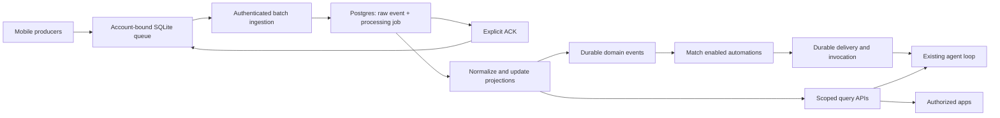

# Personal data ingestion, contacts, and agent triggers

Status: agreed development direction with implementation details still to specify. Section 10 records confirmed decisions and deferred work after user feedback on 2026-09-04. This remains a design task, not a runtime implementation.
Implementation: [phased spec](../plan/personal-data-ingestion-and-agent-triggers/implementation-spec.md), [progress](../plan/personal-data-ingestion-and-agent-triggers/progress-checklist.md), and [validation](../plan/personal-data-ingestion-and-agent-triggers/validation-checklist.md).

Reviewed: 2026-09-04. Local checkout heads: Bud `d90f3fb`, mobile `021a03e`, ingest `9876d71`.

## 1. Recommended direction

Bring ingestion into the main Bud service and Postgres, as a separate module with durable background processing. Preserve the mobile batch/ACK contract. Add a user-owned personal-data layer that both agent tools and generated apps can query through scoped APIs. Build automations as durable subscriptions and execution records, with deterministic event matching before invoking an LLM.

The first deliverable focuses on Apple Contacts ingestion and available location context. Observe `CNContactStoreDidChange`, refetch the permitted contact set and compare with the last successfully persisted snapshot. Do not write back to Apple Contacts in this pass. Health is a future deliverable; retain the existing mobile HealthKit code without making new health features a prerequisite.

The first useful end-to-end slice is:

> A contact appears after the initial Contacts baseline → persist and sync the addition → match an enabled automation → query contact/history and available location evidence → execute in a new thread or an explicitly selected existing thread. Either mobile or web can inspect and manage the same automation and results. Generated apps can query the same data independently.

“New contact” means newly observed since a prior successful scan, not verified creation at that instant. Initial contacts are queryable without automatically launching one agent per contact. An explicit, bounded “process existing contacts” operation supports flows that need to act on the baseline.

Keep the ingestion request independent of LLM availability, daemon connectivity, normalization, and trigger execution. An ACK means “stored safely,” not “the agent has acted.”

## 2. What exists today

This is a source review of the collection, upload, auth, schema, routing, and agent execution boundaries, not a runtime certification or exhaustive audit. No production data, deployed routing, real-device background behavior, or database contents were inspected. “Never used” is the supplied deployment context, not proof that no local queues or historical rows need preserving.

| Area | Implemented foundation | Missing connection or limitation |
|---|---|---|
| Mobile event capture | Versioned envelopes, installation identity, location visits/significant changes, workout and sleep samples | No contacts producer; no named places, encounter model, or general health metrics |
| Mobile durability | SQLite WAL queue, gzip NDJSON files, background URLSession, retry timestamps, BGTasks | Recovery, account isolation, ACK handling, and producer cursor ordering need work |
| Ingest | Streaming decode with size limits, partial acceptance, unique `(user_id, event_id)`, accepted/duplicate ACKs | No query API, typed projections, event jobs, subscriptions, retention/deletion implementation, or automated test suite |
| Main service | Cookie/bearer viewer resolution, owned threads/Buds, transcript/provider ledgers, tools, SSE | No personal-data model or durable agent invocation scheduler |
| Daemon | Persistent thread terminals and existing remote execution transports | Terminal persistence does not persist the service's LLM loop or schedule personal-data work |
| Generated apps | `proxied_site` and private viewer sessions route users to apps on Buds | Preview access is not a grant to read the owner's health, contacts, or location |
| Notifications | Postgres push outbox and APNs worker | Not an agent trigger queue; human-input push enqueue is still deferred in the notification spec |

Evidence entry points:

- Mobile: [EventEnvelope](../../bud-mobile/TimelineCore/Sources/TimelineCore/Events/EventEnvelope.swift), [LocationProducer](../../bud-mobile/TimelineCore/Sources/TimelineCore/Producers/LocationProducer.swift), [HealthProducer](../../bud-mobile/TimelineCore/Sources/TimelineCore/Producers/HealthProducer.swift), [TimelineCoreManager](../../bud-mobile/TimelineCore/Sources/TimelineCore/Public/TimelineCoreManager.swift).
- Sync: [SQLiteEventStore](../../bud-mobile/TimelineCore/Sources/TimelineCore/Storage/SQLiteEventStore.swift), [SyncEngine](../../bud-mobile/TimelineCore/Sources/TimelineCore/Sync/SyncEngine.swift), [BackgroundUploader](../../bud-mobile/TimelineCore/Sources/TimelineCore/Sync/BackgroundUploader.swift), [BatchBuilder](../../bud-mobile/TimelineCore/Sources/TimelineCore/Sync/BatchBuilder.swift), [BGTaskManager](../../bud-mobile/TimelineCore/Sources/TimelineCore/Background/BGTaskManager.swift).
- Ingest: [contract](../../bud-ingest/design/initial-spec.md), [route](../../bud-ingest/src/routes/ingest.ts), [persistence](../../bud-ingest/src/ingest/process.ts), [validator](../../bud-ingest/src/ingest/validate.ts), [schema](../../bud-ingest/src/db/schema.ts), [auth](../../bud-ingest/src/auth.ts).
- Bud: [message route](../service/src/routes/threads/messages.ts), [AgentService](../service/src/agent/agent-service.ts), [cancellation registry](../service/src/agent/cancellation-registry.ts), [viewer/ownership helpers](../service/src/auth/session.ts), [schema](../service/src/db/schema.ts), [push worker](../service/src/notifications/worker.ts), [legacy daemon run executor](../bud/src/run.rs).

### Concrete gaps to resolve before relying on the pipeline

1. **Ingest authentication is disconnected from normal login.** TimelineCore reads a separately stored `ingestAuthToken`; [AppSessionStore](../../bud-mobile/BudApp/AppSession/AppSessionStore.swift) sets the user ID and starts collection but does not wire its refreshable OAuth session into uploads. Standalone ingest defaults to shared-secret HS256 verification; the main service has its own OAuth resource verification. Moving the endpoint alone does not fix this.
2. **Production path routing is missing in the checked-in front door.** [Production mobile config](../../bud-mobile/Configs/Production.xcconfig) resolves ingestion to `https://app.bud.dev/v1/events/batches`. The [Worker](../deploy/cloudflare/bud-front-door-worker.js) routes `/api/`, discovery, WebSocket, and health paths, but not this path. [Vite](../web/vite.config.ts) also lacks a `/v1/events` proxy. Validate both infrastructure route bindings and application routing, including local HTTPS. A successful response from the wrong origin must never empty the queue.
3. **HealthKit cursor ordering can lose events.** Both anchored queries save the new anchor before launching unawaited `Task { try? await store.append(...) }` writes. Observer completion and the sync kick can happen first. Persist source deltas and their cursor together before reporting local processing complete; do not wait for network upload.
4. **Health source identity and deletions are missing.** Workouts/sleep lack the HealthKit object UUID, source provenance, and deletion events; anchored-query deleted objects are ignored. Fresh envelope UUIDs only deduplicate upload retries, not repeated source imports. Workouts also omit activity type; workout route samples and heart-rate/other quantity samples are not collected.
5. **Health permission status is misleading.** The producer uses `authorizationStatus(for:)` as read authorization and skips observers on `.sharingDenied`. That API describes sharing/write authorization; denied reads look like absent data. Represent read availability as unknown/observed rather than claiming permission was granted or denied. [Apple authorization documentation](https://developer.apple.com/documentation/healthkit/hkhealthstore/authorizationstatus(for:)).
6. **ACK handling is too permissive.** SyncEngine assumes full acceptance when a successful response has no ACK list. It also passes ACK IDs to deletion without intersecting them with the batch. Require a valid matching batch response and explicit ACK IDs; reject unexpected IDs. Decode permanent per-event rejection into quarantine instead of endless retry. BackgroundUploader currently ignores non-2xx retry guidance, and BatchBuilder limits count but not bytes.
7. **In-flight recovery is incomplete.** Events are marked in flight before enqueue; enqueue failure does not release them. Startup has no reconciliation between SQLite batches, files, and URLSession tasks. Success does not explicitly drain the next pending batch. Add bounded draining, persisted retry scheduling, orphan recovery, and upload concurrency limits.
8. **Background lifecycle is incomplete.** BGTask handlers launch asynchronous work and immediately report success; expiration only logs. TimelineCore starts after network-backed profile bootstrap; AppDelegate forwards URLSession events to an optional uploader that may not exist yet. Recreate background sessions and retain completion handlers during cold launch without requiring a successful foreground login/network bootstrap. Health observers should be installed during launch for an already authorized local collection session. [Apple observer guidance](https://developer.apple.com/documentation/healthkit/executing-observer-queries).
9. **Account switching can misattribute data.** There is one `events.sqlite`, one batches directory, shared HealthKit anchor keys, and a separate ingest token. Explicit sign-out stops collection but does not partition/purge these stores; other auth invalidation paths do not consistently stop TimelineCore. Bind every queue, cursor, batch, upload credential, and callback to an immutable `(environment, user, installation, collection_epoch)` context. Never upload user A's queue with user B's credential.
10. **Agent start is not durable scheduling.** The message route commits a message before calling `startUserMessage`; duplicate message retries return the existing row without ensuring a turn was started. AgentService allocates a turn ID and launches a detached promise. Its transition map and cancellation map are process-local; the short transition lock does not reserve the thread for the full execution. Add durable admission and completion, shared by human messages and automations.
11. **Existing job patterns need recovery work.** PushNotificationWorker claims with `FOR UPDATE SKIP LOCKED`, but its claim query only selects `pending`; no expired `sending` recovery appears in that worker. Reuse the approach, not an assumption that its lifecycle already meets automation requirements.

These are source-level findings. Their failure scenarios belong in the implementation test matrix; they were not reproduced on a device in this review.

## 3. Deployment choices

**Confirmed:** use the main API and Postgres. Independent ingestion isolation is not a current requirement. Alternatives below remain reference material, not implementation gates.

| Option | Benefits | Costs / reasons to choose it |
|---|---|---|
| **A. Main API + main Postgres, modular ingestion** | One user identity, migrations, transactions and operational surface; raw event and outbox insert can commit together | Selected; shared resources need bounded parsing, connection budgets and worker concurrency |
| B. Separate ingestion process in this repo, shared Postgres | Independent upload scaling/process isolation; still one transactional storage boundary | Extra deployment/auth/routing; shared DB remains a bottleneck. Reasonable extraction step |
| C. Separate service and DB behind the main API | Stronger storage isolation and independent retention/scaling | Identity federation, durable inter-service delivery, dedupe and cross-service deletion become necessary immediately |
| D. Retain standalone ingest, add readers/triggers there | Least initial movement of ingest code | Splits product permissions and agent coordination across repos; preserves today's auth mismatch |

For A, port the parser/validation/persistence logic with tests. Encapsulate its raw-body parser inside the ingestion Fastify plugin; do not copy the standalone catch-all parser into the main server globally. Preserve request limits and add stream error/disconnect tests, rate limits and per-owner storage budgets. A separate worker process can follow without changing mobile or consumer contracts.

Choose C only for a concrete isolation/scale requirement. It would ACK after its own raw-event/outbox commit, then deliver authenticated, idempotent notifications to Bud. Main API calls must not depend on an unsafe dual write across the two databases.

## 4. Data model and ownership

Personal data belongs to the **user**, independent of any Bud or conversation. An iPhone installation is a producer, not a daemon. Deleting a thread/Bud must not delete the user's source timeline. Access is granted to a consumer, not inferred from possession of a `bud_id`.

Proposed logical records (names are provisional):

| Record | Purpose and invariant |
|---|---|
| `data_installation` | Registered producer, owner, environment, collection epoch, revoked state and last sync; not `device_session` |
| `data_event` | Immutable accepted envelope, canonical owner, client event ID, source object ID/revision, event/recorded/received times, payload hash, import mode; unique `(owner, event_id)` |
| `data_processing_job` | Durable normalization work inserted with each new event; unique `(event, processor_version)`; leases, attempts and errors |
| Typed projections | First: `contact`, `contact_revision`, `location_observation`, `visit`; future: `health_sample`. Indexed reads without requiring consumers to parse raw envelopes |
| `place` / `place_presence` (future) | Named places and presence; deferred with geographic regions |
| Contact location annotation | Best-effort coordinate, observation time, accuracy and source reference; a richer encounter model can follow |
| `data_grant` | Owner's scopes and field/time/precision restrictions for an agent policy or registered app; expiry and revocation |
| `data_access_request` / `data_api_key` | Durable tool-requested permission decision and resulting query key; owner, app/purpose, approved scopes, key hash and revocation |
| `automation` / revision | Owner, enabled state, event filter or schedule, target Bud/thread policy, model, instructions, grants, budgets and retry/freshness policy |
| `automation_delivery` | One durable match, event references, frozen rule revision, dedupe key, suppression reason and next attempt |
| `agent_invocation` | Durable execution intent/status for human or automated turns; thread, turn ID, origin, lease/fencing version, outcome and cancellation actor |

New tables include `tenant_id` and `created_by_user_id`; require the resolved owner for personal-data writes even where legacy tables permit null. Separate owner stamping from the initiator (`user`, `automation`, `app`, or `system`). New service records use ULIDs; retain existing UUID thread/message IDs and client UUID event IDs. The active service schema has no standalone legacy `run` table to reuse; `agent_invocation` names the new lifecycle explicitly.

Source identity is separate from event identity. For HealthKit use object UUID plus source/store context; for Contacts retain an installation/store-scoped identifier mapped to a Bud contact ID. Do not assume Apple contact identifiers are universal across devices. Cross-device matches can be suggestions based on normalized fields, not irreversible automatic merges.

Preserve `occurred_at`, `recorded_at`, and server `received_at`. Add an explicit time basis when the actual occurrence is unknown. Projection ordering uses source revision/sequence or reconciled snapshot generation, not last HTTP arrival. Immutable events can describe updates and tombstones; “append-only” does not prohibit privacy deletion.

Initial indexes should cover owner + type + occurrence time + ID, owner + receipt time + ID, contact source identity, and due job status/time. Use bounded time queries and scalar coordinates initially; evaluate PostGIS when region/polygon query needs justify it. Raw JSON alone is inadequate for stable contact state and deletion-aware health summaries.

### Transaction boundaries

Normalization commits projection changes and domain-event work atomically. Matching commits delivery records idempotently. Duplicate ingest does not emit a second domain event. Unknown event versions remain stored and inspectable but cannot trigger rules until a supported normalizer validates them. Rebuilding projections must not rerun old automations by default.

## 5. Contacts: snapshot diff and explicit baseline processing

**Direction:** begin with `CNContactStoreDidChange` and a diff against the last successfully persisted fetch. Apple describes this notification as a reason to refetch cached contacts; it is not itself a per-contact create event. [Apple contact-store guidance](https://developer.apple.com/documentation/contacts/cncontactstore).

Persist identifiers and fingerprints of approved fields in an account/store-scoped snapshot. Coalesce notifications and serialize scans. On first link, ingest the accessible set as a baseline; on subsequent successful scans, emit additions and maintain updates/removals for accurate queries. New-contact additions are the only live subscription category in the first pass. `contact.added` is the proposed internal name; the product may label it “New contact.”

| Observation | Stored interpretation | Default automation behavior |
|---|---|---|
| First successful fetch | `baseline`, with an import/scan ID | Queryable; no live agent execution |
| New identifier after established baseline | `incremental`, with first-observed and previous scan times | Eligible for new-contact subscription |
| Known permission expansion or reset | `access_change` or `resync` | Refresh history; suppress live additions |
| Changed existing record | Contact revision | Queryable; no update subscription in first pass |
| Identifier disappears | Source no longer visible; deletion only if established | Remove from current accessible view; do not invent a new-contact event |

A diff cannot distinguish every genuinely created contact from an old contact arriving through iCloud, changed linking, or an unobserved permission-set change. Preserve that uncertainty. The previous scan and detection time describe an observation interval, not a proven creation interval. Never claim the person was met or the contact created at the phone's location when the diff ran.

Commit the snapshot/checkpoint and queued deltas together. Failed or partial scans do not advance the checkpoint or delete unseen records. Persist scan generation, previous generation and collection epoch so upload ordering cannot turn a baseline into incremental additions. Mark the server baseline complete only after its full manifest is durable; rescan if changes occurred during the initial scan. Retry uses stable event identities rather than reminting additions.

**Existing-contact flows:** keep initial import separate from action policy. Offer an explicit “Process existing contacts” operation when configuring an automation or later. It captures a bounded contact snapshot/filter, records a bootstrap request ID and produces inspectable, rate-limited deliveries. Prefer one paginated/batched agent job unless per-contact work is necessary. A bootstrap request cannot replay itself accidentally on relink or retry; a deliberate rerun gets a new request ID. Live processing starts from a persisted activation boundary so concurrent additions are neither skipped nor processed twice by bootstrap and live paths.

This lets a CRM setup organize all current contacts once, while an ongoing “follow up with new contacts” automation starts only with incremental additions. Other agents can always query existing contacts without subscribing or triggering bulk execution.

Change-history APIs are an optional later optimization/reconciliation path, not required for the snapshot-diff MVP. If adopted, Apple's nil/expired token can return drop-everything followed by all records; preserve baseline/resync suppression. [Apple TN3149](https://developer.apple.com/documentation/technotes/tn3149-fetching-change-history-events).

iOS 18 permits limited contact access and changes to the allowed set. Fetch only approved fields; omit photos/notes initially. Disappearance from the accessible set must not be presented as verified deletion. [Apple contact access guidance](https://developer.apple.com/documentation/contacts/accessing-the-contact-store).

Reconcile on foreground entry, store-change notifications while running, and available background opportunities. Do not promise immediate detection of another app's contact save while Bud is suspended. History starts at collection; neither prior edits nor encounters can be reconstructed from the current address book. Writing to Apple Contacts and a separate Bud contact editor are outside this first ingestion slice.

## 6. Location and health semantics

**Contact/location correlation:** use an explicitly known encounter time when supplied; otherwise retain the observation interval and return only location context whose meaning is clear. Include sample timestamp, age, horizontal accuracy, source and candidate place. A first-discovered contact with unknown creation time must not inherit the phone's current location as its creation location. “Phone was near this cafe when the contact was detected” can be evidence; it does not establish where the user met the person.

**Confirmed first pass:** query available evidence immediately and show a best-effort pin on a map, with observation time and accuracy where available. No enrichment wait, geofence lookup, venue inference or configurable correlation engine is required. When evidence is unusable or absent, show unknown/no pin. Later uploads may improve the annotation without repeating completed agent actions.

**At home — deferred:** geographic regions and named-place presence are outside the next pass. Future work can add a user-defined place and an explicit presence policy. Visits/significant changes provide sparse historical evidence, not continuous occupancy. Define enter/exit hysteresis, optional dwell, freshness expiry and `unknown`; do not fire on every inside sample. An initial inside observation establishes baseline rather than inventing an arrival. If prompt arrival triggers matter, evaluate on-device region monitoring as a separate mobile capability; keep upload delays visible. BGTasks' earliest date is not a guaranteed schedule. [Apple scheduling contract](https://developer.apple.com/documentation/backgroundtasks/bgtaskrequest/earliestbegindate).

**Workout/location:** intersect workout start/end with available visit/location intervals and return evidence coverage. Current capture cannot produce a continuous workout route. Detailed route support requires an additional producer/query path and consent decision.

**Health — deferred:** preserve the current mobile producers; health queries, triggers, workout/location joins and new health projections are a future deliverable. Source identity/cursor fixes, sample precedence, summary windows, lookback and per-device health backlog policy remain tracked for that work. Existing health envelopes should remain compatible with ingestion, but must not activate unsupported health automations. Shared transport/account fixes still apply to every event. Do not promise reliable health monitoring until the source-level gaps above are addressed. Empty data may mean no samples, denied read access, a locked/unavailable store, or delayed sync; it is not evidence that the user had no activity.

Provide `last_received_at`, per-source collection/import status and coverage separately from `latest_occurred_at`. A current upload can contain old samples. Absence-based rules need scheduled evaluation and fresh coverage; they cannot infer a health condition merely from no upload.

## 7. Access for agents and generated apps

Build one authorization/query layer with adapters for first-party clients, agent tools and generated apps. The first implementation exposes contacts/location; health interfaces below are future extensions:

| Consumer | Authentication and authorization | Example interface |
|---|---|---|
| First-party web/mobile | Existing viewer resolution; owner filters in SQL before reads and stream attachment | `/api/data/contacts`, `/api/data/contacts/:id/history`, `/api/data/location`, `/api/data/health`, `/api/data/status` |
| Service agent | Server-derived invocation owner, thread/Bud ownership and explicit data grant | `contacts.search`, `contacts.history`, `timeline.query`, `location.context`, `health.query` |
| Generated app backend (first pass) | Query API key minted after its data owner approves a tool-requested grant | Same query service through an app-authorized API |
| Generated dashboard (future broker) | Resolve the authenticated dashboard viewer and that viewer’s app/data grant | Viewer-specific data; never substitute the app builder’s identity |

Tool/route names are proposals. Queries need bounded time ranges, pagination, field selection, normalized units, evidence IDs, and freshness/coverage metadata. A stored-history query should not wake the phone. Keep raw-envelope export a separate privileged surface.

Grants distinguish contacts fields, health types, coarse/precise location, history windows, derived encounters, and trigger management. An app's ability to view a `bud.show` preview or an agent's ability to operate a terminal does not automatically authorize personal-data access. Initially support private owner apps; shared/multi-user applications need a separate design and must never expose the builder's data to arbitrary visitors.

**Confirmed first integration: tool-requested API key, approved in either client.** An agent can request a data-query key while building an app; the service mints it only after the owning human grants permission. A proposed tool such as `data.request_api_key` carries an app label/purpose and requested query scopes. The exact tool name and payload remain implementation details.

1. Persist a permission request bound to the authenticated thread/invocation owner, tool call and requested app grant. No credential exists yet.
2. Show an approval card in mobile and web describing whose data, which categories and which app/purpose will receive access. Both clients read the same durable request; approve in either, or decline. Changing requested scope requires a new decision.
3. The approval route resolves the human viewer, authorizes ownership before mutation, and atomically records the decision and one key/grant. Retried approvals must not mint duplicate keys. Decline/cancel issues none; pending requests survive disconnects and restarts.
4. Resume the tool with a credential handoff for agent/app setup. Store the key server-side in the generated app, outside browser JavaScript and Git. The service keeps a verification hash; normal logs, SSE and durable chat/tool history contain key ID/grant metadata, not the raw secret. The implementation must define secret delivery and interrupted-handoff recovery rather than send the key through the ordinary persisted tool-result serializer.
5. Each query verifies the key and active owner-scoped grant. Mobile and web expose key/grant inventory and revoke. The key authorizes data queries, not further key issuance or account permission changes.

This approval grants app data access; it adds no terminal restriction. The agent retains normal Bud tools. The temporary key represents its approving owner and does not change identity for different dashboard visitors; the first app path is private-owner use.

**Confirmed future direction:** broker access based on the authenticated user actually using the dashboard. Resolve that viewer and their consent for each app data request, so a shared dashboard never exposes the builder's personal data to everyone. Broker placement remains open; it is not inherently a daemon-local credential store. Viewer-specific brokering is follow-up work, separate from first-party mobile/web parity.

Recheck grants at each read and before automated execution. SQL must filter by resolved owner; unauthenticated requests get `401`, another user's resource gets `404`. Background workers resolve the stored owner and revalidate the current automation, target and grants rather than impersonating an arbitrary client-supplied user ID. Stamp messages, invocation records and terminal sessions with the owning user; human cancel records include the acting user.

Event delivery to apps can follow the same subscription model later. Start with durable polling cursors; SSE is a convenience, not the delivery ledger. A receipt-time cursor must account for transaction commit ordering (a bare sequence allocated before commit can skip late commits); use explicit delivery records or a bounded overlap/dedupe design. Webhooks need signed delivery IDs, ACK/retry semantics and destination restrictions before enabling them.

## 8. Agent triggering and durable execution

An automation is a standing user instruction with explicit inputs, target and budget. Natural language can help draft it, but activation exposes the filter, data access, model and cost limits. **Confirmed development policy:** all agents have normal Bud terminal access. Do not introduce read-only modes, action allowlists or additional terminal approval gates for automated turns. Existing ownership boundaries and the explicit app-data key permission flow still apply. The model cannot approve its own data-key request or silently activate a recurring rule.

### Match before invoking

Use `contact.added` for incremental additions in the first pass, with explicit bootstrap deliveries for requested existing-contact processing. Future domain events include `workout.completed`, `place.entered` and scheduled ticks. A deterministic matcher evaluates event type, import/live mode, source, time, place and freshness constraints. Only a match creates work for the agent. Do not spend an LLM turn on every captured sample.

Persist the automation revision, event/evidence IDs, instructions, grant references, model selection and target on each delivery. Unique `(automation_id, revision, domain_event_id)` prevents replay duplication; aggregate/window rules need their own stable window key. Rule edits do not replay old data unless the user requests a bounded backfill. Record causation IDs/depth so agent-generated changes cannot create an unbounded feedback loop.

### Execution lifecycle

Proposed states:

`pending → leased → running → succeeded | failed | canceled | needs_review`

`leased/running → waiting_for_bud | waiting_for_user | retry_wait | expired`

Each wait is durable, has a reason and policy, and releases the worker slot. An execution waiting on user input must restore from its question record after restart. The current live question promise/fallback message mechanism needs adaptation so it continues the same automation delivery rather than silently creating unrelated work.

Implementation requirements:

- Atomically insert the trigger input and `agent_invocation`; reserve a stable `turn_id` before invoking the loop. Refactor AgentService to accept that ID and report durable outcome, rather than allocate hidden IDs and return only “started.” Route human sends through the same admission boundary, closing the message-persisted/start-lost gap.
- Use short SQL claim transactions, expiring leases, heartbeat renewal, bounded retries and a worker fencing token. Enforce one executing invocation per thread in the database; the local map remains an optimization. Revalidate the fence before provider/tool dispatch and outcome writes. Lease loss cancels the old executor; uncertain external effects are reconciled rather than duplicated.
- Give human sends priority at safe admission boundaries. A trigger never supersedes a human question or sends input into the active user's TUI. Existing-thread targets queue behind active work. Multiple threads still share the Bud filesystem, so cap per-Bud work and allow project-level serialization where jobs touch the same files.
- For this first automation pass, require the selected Bud and model to be available before starting. If either is offline/unavailable, persist the wait and expire visibly at the latest-start deadline. Do not substitute models or start a reduced service-only automation. Existing manual-chat offline behavior and independent queries of already ingested data remain separate.
- A service restart does not prove a terminal command failed. Claiming once is not exactly-once execution. Persist action intent/idempotency keys, inspect available command/operation evidence, and mark ambiguous side effects `needs_review`. Retry only known-safe work; a generic shell action cannot be made exactly-once by a queue constraint.

**Confirmed target options:** new thread per invocation, or opt-in existing thread. A persistent dedicated automation thread can use the existing-thread option after creation; it need not be a third execution mode. New threads provide separate transcripts and terminals; existing threads retain conversational context and workspace state but must queue behind active/waiting work. Store target policy on the automation so both mobile and web expose the same choice. Automation instructions and referenced data remain durable outside conversational summaries.

Trigger inputs are visible as “Automation: new contact” with source time and event links. Do not forge a human message or promote contact fields to system instructions. Persist an origin-tagged input artifact and explicitly adapt conversation loading/provider replay; the current loader must not silently omit that artifact. Existing message metadata can identify the origin without a new message role initially. Treat names, notes and imported text as untrusted data.

### Replay, lateness, cost and notification policy

- Baseline import and projection rebuild update history but suppress live actions by default.
- Each rule declares maximum event age, offline wait limit, cooldown/coalescing and late-data policy. Historical health records should not produce a burst of current alerts.
- Pause/disable prevents new starts; offer cancel-pending and cancel-active separately. Deleting the target or revoking access invalidates queued work. A paused queue resumes only within its age policy.
- Cap invocations per rule/user/day, provider tokens/cost, execution time, tool steps and concurrent Bud work. Quarantine repeated failures and expose them in activity history.
- APNs is an output channel after relevant results become durable. Suppress empty/no-action results, offer a digest, and redact sensitive previews by default for these automations. Agent triggering never depends on phone push delivery.

## 9. Collection consent, revocation and deletion

OS permission, cloud ingestion consent, LLM processing consent and app/automation grants are separate decisions. Onboarding should name which data is uploaded and where it can be used. An OS permission snapshot in an envelope is diagnostic information, not server authorization.

Development scope retains signed-out queues for testing, isolated by account and environment; collection and uploads stop until that same account is authorized again. TODO before shipping: decide and implement discard-on-sign-out, currently the preferred shipping direction. Existing unscoped queues require an explicit migration/quarantine policy, never automatic reassignment.

Retention periods, encryption scheme selection and comprehensive deletion workflows are follow-up work, not prerequisites to the development slice. Account isolation, authenticated access, credential revocation and safe ACK handling remain required now. The remaining paragraphs describe the future deletion contract; this development milestone makes no production deletion/retention guarantee.

Deletion must cover raw events, projections, derived encounters, pending jobs, caches, exports and execution context that copied sensitive fields. Minimize copies in transcript/provider/debug logs; use references and bounded results. Define backup retention and restore-time deletion replay, and document the limits of deleting data already disclosed to an external model or exported app. The old ingest spec proposes per-user encryption keys/crypto-shredding, but `key_version` is currently null and that machinery is not implemented. Decide the required deletion guarantee before making it a product promise.

Prevent stale offline uploads from resurrecting deleted history: revoke collection epochs for account/source resets and reject events covered by deletion tombstones or an explicit history cutoff. Normal HealthKit/Contacts source deletions use tombstones and recompute projections; privacy deletion may remove the source payload entirely. Fresh reimport must require a deliberate policy.

## 10. Decision register after user feedback

| Decision | Current direction | Status / remaining question |
|---|---|---|
| Hosting | Main API and Postgres | Confirmed; no independent ingest isolation now |
| Contacts product | Observe Apple Contacts; snapshot diff; no Apple write-back | Confirmed direction; separate Bud editor not required by this ingestion slice |
| New-contact semantics | Incremental additions by default; baseline queryable; explicit existing-contact processing | Confirmed; preserve timing uncertainty |
| Capture identity | Retain isolated queues for development | TODO: finalize shipped sign-out discard policy |
| Upload auth | Wire current OAuth refresh into uploads now | Dedicated revocable upload-only credential agreed as follow-up; expired requests retain/retry data meanwhile |
| Automation target | New thread per invocation or opt-in existing thread | Confirmed; both use durable serialized admission |
| Automated authority | Normal Bud terminal access for all agents | Confirmed; no additional development action restrictions |
| App consumption | Agent requests API key; human approves in mobile/web; service mints key | Confirmed; future broker uses the dashboard viewer’s auth |
| Location responsiveness | Existing sparse collection | Confirmed; geographic regions deferred |
| Health scope | Preserve mobile HealthKit code; health is future delivery | Deferred: precedence, summaries, metrics, lookback/backlog and health productization |
| Correlation | Immediate best-effort map pin with uncertainty; later annotation updates | Confirmed; no enrichment wait or repeated actions |
| Retention/encryption | Focus on working development pipeline | TODO follow-up: retention periods, deletion contract and encryption scheme |
| Bud offline | Wait for selected Bud/model; expire visibly when stale | Confirmed; no automatic fallback; richer recovery deferred |
| User experience | Seamless mobile/web authoring, management and history | Confirmed; shared backend state and semantics |

### Confirmed behavior and follow-up boundaries

**Automated authority — confirmed.** Agents always retain normal Bud terminal access in development. There is no read/draft-only mode, special action allowlist or extra automation terminal permission tier. Thread serialization and existing ownership checks still apply. User approval of an app data key is a separate permission explicitly requested by this design.

**App credentials — confirmed.** An agent tool requests permission; the human approves in mobile or web; the service mints the query API key and resumes setup. The future broker must authorize using the dashboard viewer's identity and grants, not the builder's key. Section 7 defines the initial approval flow.

**Geographic regions — deferred.** Existing location capture is sufficient for the next contacts pass. Named places, entry/exit monitoring and “at home” triggers are a future change. Region monitoring can later report geographic boundary transitions, but its lifecycle and place configuration are not prerequisites now. [Apple region monitoring](https://developer.apple.com/documentation/corelocation/monitoring-the-user-s-proximity-to-geographic-regions).

**Correlation — confirmed simple approach.** Query available evidence immediately and show a best-effort map pin with timestamp/accuracy and uncertainty. Return no pin if usable evidence is absent. Contacts diffs establish detection, not a verified meeting location. Later enrichment may update the annotation but never repeats completed actions. Configurable time windows, accuracy thresholds and enrichment waits are deferred.

**Offline behavior — confirmed.** Automated invocations wait if the selected Bud or model is unavailable and expire visibly when stale. No cloud substitution or reduced-capability execution in this pass. A latest-start deadline is still needed; the concrete default remains an implementation detail. More robust recovery and any future explicit cloud fallback are later work. This policy applies to new automations, not a redesign of existing manual chat.

**Mobile/web parity.** Persist automation drafts/revisions, target choice, pause state, grants, bootstrap jobs and execution history on the service. Either client can configure a rule and the other can inspect, edit, pause or follow it. Use optimistic version checks for concurrent edits and canonical status fetches after reconnect; clients need not stay open for execution. Contacts permissions and location monitoring remain mobile responsibilities, with their latest reported status visible on both clients.

### Follow-up TODOs

- Finalize shipped sign-out queue disposal; retain account-isolated queues during development.
- Add dedicated revocable upload-only credentials after initial OAuth-backed integration; do not extend broad API token lifetimes as a substitute.
- Productize health later: source durability/identity fixes, precedence, summary windows, lookback/backlog and additional metrics. Preserve current mobile code.
- Define production retention, deletion/backups and encryption schemes after the development slice.
- Add a broker that authorizes the actual dashboard viewer, with per-viewer consent and data isolation.
- Add geographic regions/named places and richer contact/location correlation in a future change.
- Improve offline recovery and consider explicit cloud fallback later; preserve selected Bud/model during the first pass.

## 11. Delivery sequence and acceptance gates

| Stage | Deliverable | Gate |
|---|---|---|
| 0. Contract and recovery | Settle identity/contacts semantics; fixtures for old envelopes and ACKs; mobile queue/cursor recovery | No silent loss, account mixing or false “new contact” baseline events |
| 1. Integrated ingestion | Port module, main auth, compatible route, migrations, raw event + durable jobs | Real mobile → public origin → DB → explicit ACK; retry does not duplicate jobs |
| 2. Readable personal data | Contacts snapshot/diff ingestion, contacts/location projections, scoped reads/tools and status on mobile/web | Baseline is queryable without firing live rules; two-user tests prevent cross-account access |
| 3. First contact automation | Incremental additions, optional explicit existing-contact bootstrap, durable invocation, new/existing thread targets; mobile/web authoring and history | Configure on one client and manage on the other; closed clients, offline Bud and restart give durable outcomes |
| 4. First generated app | Tool-requested API-key permission card in mobile/web, key issuance and setup, example private contact/history map app | Approval in either client issues one key; denial issues none; revocation blocks queries |
| 5. Follow-up location/automation | Optional Contacts change-history optimization, places/presence and scheduled rules | Device-tested latency, resync suppression, late-data behavior and bounded cost |
| Future health delivery | Preserved HealthKit producers → source fixes, health projections, queries, workout joins and summaries | Separate scope and acceptance plan; does not block contacts/location development |

Stages 3 and 4 are both part of connecting data to agents **and** their apps; a tool-only implementation does not complete the product goal.

Minimum validation scenarios:

- Mixed valid/rejected/duplicate batches; truncated gzip, size/count limits, disconnect mid-body, DB failure and lost ACK; same event ID with conflicting payload preserves original and records a redacted conflict.
- Empty/missing/wrong-batch/foreign-ID ACKs do not delete unrelated events; permanent rejection is visible; 401 refresh, 429 retry hints and 413 batch splitting work.
- Kill the app between source read, SQLite commit, cursor advancement, marking in flight and enqueue; relaunch URLSession tasks; locked-device/first-unlock and storage-full behavior remain recoverable.
- Switch A→B with A's pending/in-flight uploads, anchors and callbacks; expire/revoke login; change environment. No cross-account write is possible.
- Contacts baseline, interrupted scans, permission expansion/reduction, link/unlink, removal and two-device observations do not masquerade as verified new encounters. Bootstrap/live activation does not lose or double-process additions; relink does not replay bootstrap automatically. Test history-token expiry if that API is adopted later.
- Late, inaccurate or conflicting location yields uncertain/unknown context or no pin; later enrichment does not rerun actions. Presence-transition tests belong to the future region-monitoring change.
- Worker crashes before/after commit/start/tool dispatch; two workers and simultaneous human sends; stale lease holder; cancellation and waiting-user restoration. No concurrent writers to one terminal, no silent replay of ambiguous actions.
- Read/list/history/stream/app grant tests use two users; authorize before replay/listeners; deleted target and revoked grant suppress queued work.
- Request an API key from an agent tool, approve in the other client, and resume setup. Denial/cancellation issues no key; concurrent approvals and retries issue only one. Another user cannot approve/read the request. Revoked keys fail queries, and raw secrets never appear in ordinary logs or transcript/stream payloads.
- Unavailable Bud/model keeps automation queued; recovery starts it only before its deadline, expiry is visible, and no model is substituted. Automated turns have the same normal terminal tools as manual turns.
- Old mobile envelopes/new API and new mobile/API-unavailable paths retain data safely. Before shipping deletion features, verify that deletion followed by stale upload cannot resurrect history.
- Measure device capture-to-receipt separately from receipt-to-action latency, power/network use, oldest queue age, projection lag, retries/dead letters and per-rule spend. No raw contact/health/location payloads in routine logs.

## 12. Rollout and documentation

This document adds no running service, schema or wire changes. The [review plan](../plan/personal-data-ingestion-and-agent-triggers.md) tracks the design work.

Implementation should deploy additive schema and ingestion support first, with automation disabled. Preserve `/v1/events/batches` and explicit ACK responses for existing clients; optionally add an `/api/data/...` alias later. Update Cloudflare Worker route bindings, Worker path classification and local proxy/Caddy configuration together. New mobile clients retain queued data on unsupported endpoints and use feature discovery before relying on new semantics. Old clients can continue raw capture but cannot supply newly required source identities; mark their derived coverage accordingly.

Inventory standalone DBs and local queues before retirement. If there is data, migrate with an explicitly verified identity mapping and preserved event IDs/receipt times; do not map all `dev` data to a production user. Backfill projections with live triggers off. Keep rollback ingestion/ACK-compatible so a failed automation release cannot lose uploads.

The default implementation changes no Bud↔service messages: new service + old daemon uses existing terminal tools; old service + new daemon behaves as before. Full contact/location functionality requires the mobile update and service deployment, not a daemon upgrade. The implementation spec makes protected app-key handoff a phase-0 engineering gate. If it requires a new device operation, capability-gate that operation, document the old-daemon fallback and any upgrade requirement, and test both mixed-version pairings. Future broker operations follow the same rule.

Implementation specs to update: root, service/source, auth, routes, DB and migrations, agent/runtime, notifications, and web feature/component specs for new surfaces; add specs for new data/automation folders. Update `docs/proto.md` for any new SSE/wire shapes, the auth validation checklist for every data route/stream, mobile event/ingest/producer docs, and standalone ingest handoff/retirement docs. Deployable schema changes require `pnpm db:push`, checked-in `pnpm db:generate` migrations and staging migration verification. Do not rewrite current architecture specs to describe this proposal as already implemented.
