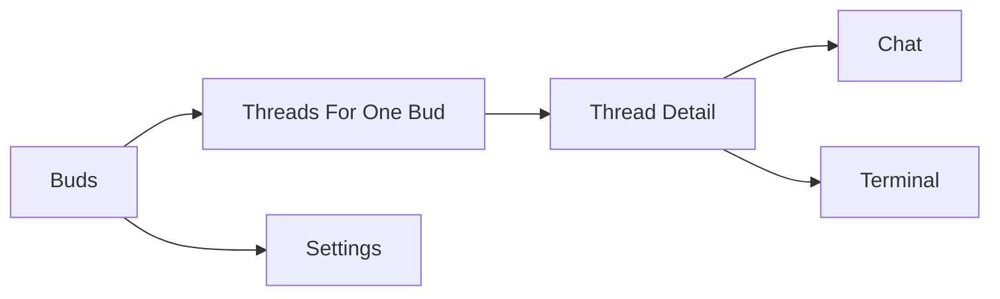

# Web App Overview And iOS Feature Parity

Last updated: 2026-03-19

## Purpose

This document fills the gap between:

- the existing mobile auth/OAuth docs, which explain how a native client should sign in, and
- the actual product behavior in the current web app, which defines what mobile should feel like once authenticated.

This is the product and UX handoff document for the native iOS app. It explains:

- what the current web app actually does today,
- which parts are core product behavior versus browser-specific chrome,
- what "feature complete" mobile parity should mean for Bud v1, and
- how the current desktop workbench should translate into an iOS-native navigation model.

Companion docs:

- [plan/mobile-auth/mobile-team-handoff-guide.md](../plan/mobile-auth/mobile-team-handoff-guide.md) for OAuth/OIDC and bearer-token integration
- [design/backend-web-better-auth-oauth-provider-spec.md](./backend-web-better-auth-oauth-provider-spec.md) for backend/web auth design details
- [design/authentication-and-user-ownership.md](./authentication-and-user-ownership.md) for ownership, claim flow, and product auth boundaries

## Executive Summary

Bud is not a generic chat app. It is a device-oriented workbench with a strict hierarchy:

1. a user owns one or more Buds
2. each Bud contains many threads
3. each thread contains messages and owns its own persistent tmux-backed terminal session

The current web app expresses that hierarchy as a three-pane desktop workspace:

- Bud rail on the left
- thread list in the middle
- active thread workspace on the right

The mobile app should preserve the same mental model, but not the same literal layout. On iPhone, the correct translation is a navigation stack:

- Bud list
- thread list for one Bud
- thread detail with Chat and Terminal modes

On iPad, a split-view layout can more closely mirror the desktop shell, but that is an enhancement, not a requirement for v1.

The most important product truth to preserve on mobile is this: a thread is not just a conversation. It is also the container for a persistent terminal session. Mobile must therefore surface thread status, terminal status, and Bud online/offline state as first-class UI, not as hidden diagnostics.

## Current Product Model

### Core entities

| Entity | What it means in product terms | Why mobile must care |
| --- | --- | --- |
| `Bud` | A remote machine running the Bud daemon | Users choose which machine they are working with before they choose a thread |
| `Thread` | A scoped workstream on one Bud | Threads are the primary navigation unit inside a Bud |
| `Message` | A chat event inside a thread | User, assistant, tool, and system messages form the visible timeline |
| `Terminal session` | A persistent tmux-backed shell owned by one thread | The terminal is not global to the Bud; it follows the thread |

### Critical domain rule

Each thread owns at most one active terminal session at a time, and that session persists across reconnects and route changes. The mobile app should never flatten Buds and threads into a single "conversation list" without preserving which Bud a thread belongs to.

### Session states that matter to UX

The current service and web app expose terminal session states such as:

- `pending`
- `creating`
- `ready`
- `active`
- `idle`
- `closed`

The current web UI also distinguishes connection state from session state:

- `connected`
- `reconnecting`
- `offline`
- `disconnected`

That distinction is important on mobile too:

- a thread can exist while its Bud is offline
- a terminal session record can exist before the daemon has resumed it
- an agent run can be canceled separately from interrupting the remote terminal

## What The Current Web App Does

### 1. Authentication and entry

The web app has an auth-aware root shell:

- `GET /api/me` is loaded before protected routes render
- anonymous users are redirected to `/login`
- signed-in users are routed into the workspace or the authenticated empty state

Current top-level routes:

- `/login`
  Browser login page for GitHub/Google Better Auth sign-in
- `/auth/mobile`
  Hosted mobile login page used by the native OAuth flow
- `/auth/mobile/consent`
  Hosted mobile consent page used by the native OAuth flow
- `/settings`
  Account/profile page
- `/devices/claim/$flowId`
  Public Bud claim page for QR/link approval
- `/`
  Authenticated entry that redirects into the first owned Bud if one exists

Important product note:

- `/auth/mobile` and `/auth/mobile/consent` are support surfaces for native auth, not core product screens
- they should not drive the post-login IA for the iOS app

### 2. Authenticated empty state

If a signed-in user has no Buds, the web app does not show an anonymous landing page. It shows an authenticated empty state that explains:

- the user is signed in
- no Buds are enrolled yet
- the next action is to enroll or claim a Bud

The mobile app should preserve that distinction. "No Buds" is a valid signed-in product state, not an auth failure.

### 3. Desktop workspace shell

Once a user has Buds, the main web UI is a three-part workspace.

### Bud rail

The left rail shows:

- every owned Bud
- the active Bud
- real-time online/offline status
- a theme toggle
- a settings button
- an "add Bud" placeholder button

This rail is desktop chrome, not a required mobile layout. The important product behavior is:

- users can switch Buds at any time
- Bud online/offline state is visible at the Bud-selection level

### Thread panel

For the active Bud, the thread panel shows:

- threads sorted by recent activity
- thread title
- last message preview
- message count
- whether a terminal session exists
- terminal session state badge
- delete-thread action
- "New" action
- a terminal-sessions modal entry point

This is the strongest indication of the real product model: threads are not just messages, they are lightweight workspaces with terminal state.

### Active workspace

The main pane contains:

- a top bar
- a chat timeline
- a terminal pane
- a bottom command composer

The top bar currently includes:

- thread-panel toggle
- simple status label (`Idle`, `Dispatching`, `Streaming`)
- a two-state view toggle between `terminal` and `web`

Important reality check:

- the `web` view is only a placeholder right now
- it is not a real product capability and should not be treated as parity-critical for mobile

### 4. Thread behavior

### New thread route

`/$budId/new` is a pre-thread workspace:

- empty chat area
- terminal placeholder
- message composer
- model selector
- reasoning selector

When the user sends the first message:

1. the client creates a thread via `POST /api/threads`
2. it posts the first user message via `POST /api/threads/:id/messages`
3. it navigates into the real thread route

Mobile should preserve that behavior conceptually, but it does not need a separate "new thread screen" if a composer-first flow is more natural. A "new thread" can simply become "compose the first message for this Bud."

### Existing thread route

`/$budId/$threadId` is the real product workspace. It does all of the following:

- loads the last 200 messages
- auto-connects to the agent SSE stream
- creates or resumes the thread terminal session
- attaches to terminal SSE
- backfills terminal history
- tracks terminal readiness
- tracks reconnect/offline state
- lets the user send new messages
- lets the user cancel the current agent turn
- lets the user send terminal interrupt (`Ctrl+C`)

This route is effectively the source of truth for what mobile parity should mean.

### 5. Message timeline behavior

The current web timeline supports:

- user messages
- assistant messages
- tool messages
- optional system messages

Rendering details:

- assistant and user content render as Markdown
- code blocks get syntax highlighting and copy affordances
- tool calls render specialized UI (for example, `terminal.run` shows shell input)
- long messages collapse with expand/collapse controls
- every message can be copied

For mobile, the important behavior is not the exact neobrutalist styling. It is:

- Markdown readability
- tool-call visibility
- copy/export affordances where useful
- robust handling of long assistant responses

### 6. Composer behavior

The web composer supports:

- multiline text entry
- Enter to submit
- model selection
- reasoning-effort selection
- loading/streaming states

This is already close to a viable mobile control set, but the desktop presentation is too dense for iPhone. On mobile, model and reasoning should likely move behind a secondary sheet or inline "options" drawer.

### 7. Agent streaming behavior

The web app listens to `/api/threads/:threadId/agent/stream` and updates the timeline in real time.

The current UI behavior includes:

- user message posts immediately
- agent tool calls appear in the thread as tool cards
- assistant partial/final messages appear via stream events
- stream completion triggers a fresh message reload
- a Stop action calls `POST /api/threads/:threadId/cancel`

The mobile app should preserve the same turn model:

- message is sent
- thread enters in-progress state
- streamed activity becomes visible
- Stop aborts the agent loop

Important product constraint:

Stopping the agent is not the same as interrupting the remote shell process. The current service treats these as separate actions, and mobile should model them as separate controls.

### 8. Terminal behavior

The web app treats the terminal as a first-class peer to chat, not as a hidden implementation detail.

Current behavior:

- thread route creates or reuses a terminal session record
- route calls `terminal/ensure` to resume or create the real tmux session
- terminal output streams over SSE
- terminal history can be backfilled
- terminal input is posted through a dedicated endpoint
- resize is sent only when dimensions actually change
- readiness analysis is displayed while the agent is working
- reconnect/offline overlays appear during connection problems

Important terminal UX cues already present on web:

- state bar with connection status
- readiness signals such as prompt/pager/password/error hints
- "Earlier output truncated" warning when history is clipped
- reconnecting versus offline presentation
- `Ctrl+C` terminal interrupt in a menu

For mobile, this means parity is not just "show the last chat messages." It also means:

- show terminal status
- show live output or recent output
- allow deliberate terminal interaction
- recover cleanly when the Bud is offline or reconnecting

### 9. Bud session management

The web app has a Bud-scoped terminal-sessions modal that lists active sessions with:

- session state
- linked thread
- last activity
- output size
- close-session action

This is secondary UI, but it reflects an important operational concept: sessions are inspectable objects, not invisible internals. Mobile parity should include a Bud-level session-management screen or sheet, even if it is not part of the first happy-path flow.

### 10. Device claim flow

The current web stack already supports a phone-friendly Bud claim flow:

- daemon starts a claim
- server returns claim URL and QR payload
- browser opens `/devices/claim/$flowId`
- anonymous users are redirected through login
- authenticated users auto-approve
- page polls until the Bud is approved/completed
- page deep-links into the claimed Bud

This is highly relevant to mobile. Even if the native app does not implement a first-class claim UI on day one, the app should at minimum:

- open claim links correctly
- let the user authenticate and approve the claim
- return the user to the app or the newly claimed Bud afterward

## Core Product Versus Browser-Specific Chrome

### Must preserve on mobile

- Bud selection
- thread selection within a Bud
- message timeline
- model/reasoning choices for sending a message
- agent streaming state
- thread-scoped terminal session status and output
- terminal input and interrupt behavior
- Bud/session management
- settings/account management
- claim-link handling

### Not required for parity

- desktop three-pane layout
- Bud rail numbering
- theme toggle
- neobrutalist styling itself
- dev-only debug panel
- placeholder `web` view
- auth-page metadata panels used to inspect OAuth request details in browser

## What "Feature Complete" Mobile Should Mean

The mobile app can be called feature complete when a signed-in user can do every core Bud task without returning to the web app.

| Area | Feature-complete expectation |
| --- | --- |
| Auth | Sign in natively through the hosted OAuth flow and maintain bearer-authenticated API access |
| Bud inventory | List owned Buds, see online/offline state, choose the active Bud |
| Thread list | View threads for a Bud, see recency, preview text, message count, and terminal/session state |
| Thread creation | Start a new thread by composing the first message for a Bud |
| Message history | Read the full thread timeline with Markdown and tool-call rendering |
| Message send | Send a message with optional model/reasoning overrides |
| Agent lifecycle | See in-progress state, live tool/message updates, and stop the current run |
| Terminal visibility | View thread terminal state, readiness hints, and recent/live output |
| Terminal control | Send terminal input and explicit interrupt when needed |
| Recovery states | Understand when the Bud is offline, reconnecting, or when output is truncated |
| Session management | Inspect active sessions for a Bud and close a session deliberately |
| Device claim | Open and complete claim links from a phone |
| Settings | View identity, edit username, inspect linked providers, sign out |

That scope is intentionally smaller than "perfect desktop parity." The current web app is still a prototype, and much of its visible complexity is desktop layout, not core product breadth.

## Recommended iOS Information Architecture

### 1. iPhone

Recommended IA:

Recommended screen structure:

- Root tab bar
  - `Buds`
  - `Settings`
- `Buds` tab
  - list of owned Buds
- selecting a Bud pushes
  - Bud detail / thread list
- selecting a thread pushes
  - thread detail with segmented control or top tabs for `Chat` and `Terminal`

Why this is preferable to a literal desktop port:

- mobile needs explicit navigation depth
- Bud choice is more important on mobile because the Bud rail is no longer always visible
- chat and terminal compete for vertical space on iPhone, so they should not be forced into a simultaneous split view

### 2. iPad

Recommended IA:

- optional three-column split view
  - Buds
  - Threads
  - Thread detail

This can mirror the web mental model more closely, but it should reuse the same underlying screen models as iPhone rather than becoming a separate product design.

## Screen-Level UX Recommendations

### 1. Bud list

The Bud list should show:

- display name
- online/offline status
- optional tags/capabilities if useful
- last activity or last seen timestamp if available later

Recommendations:

- if the user has one Bud, still show a Bud list at least once so the device-oriented model is legible
- after first use, it is reasonable to reopen into the last active Bud/thread
- surface an obvious entry point for claim/enrollment once that flow is wired into mobile

### 2. Thread list for one Bud

This screen is the mobile replacement for the thread panel.

Each thread cell should show:

- title
- last message preview
- relative activity time
- message count
- terminal/session badge

Recommendations:

- make terminal state visible in each row, not only inside thread detail
- place destructive thread delete behind swipe actions or a context menu
- expose "New thread" as a primary action in the navigation bar
- expose Bud-level session management from this screen via a sheet

### 3. Thread detail: Chat tab

This is the primary day-to-day screen for most users.

Recommended layout:

- thread header with Bud name and thread title
- compact status row for agent state and Bud/terminal state
- scrollable message timeline
- pinned composer at the bottom

Recommendations:

- default to `Chat` as the first tab
- preserve Markdown rendering and code-block copy
- render tool calls as compact cards, with expandable raw payload if needed
- show streamed assistant/tool activity inline instead of waiting for the final response
- keep Stop visible while the agent is running

### 4. Thread detail: Terminal tab

This is where mobile has to diverge from web without losing capability.

Recommended behavior for v1:

- show live terminal output or the latest backfilled output
- show session state and Bud connection state in a sticky status header
- allow explicit terminal input via a dedicated input field
- allow interrupt as a clear destructive/secondary action

Recommendations:

- do not try to reproduce a tiny always-on desktop shell with constant keyboard focus
- use an explicit "Send input to terminal" affordance instead of assuming freeform terminal typing is always active
- preserve distinctions between:
  - agent running
  - terminal ready
  - terminal reconnecting
  - Bud offline
- show the truncated-history warning if the server indicates not all output was loaded

If a full terminal emulator proves awkward on iPhone, a hybrid approach is still acceptable for parity:

- rich live output view
- explicit input box
- interrupt action
- optional "advanced terminal mode" later

The key requirement is capability, not a pixel-perfect xterm clone.

### 5. Composer options

Model selection and reasoning effort are already present on web, but they should not dominate the mobile composer.

Recommended mobile treatment:

- primary text field plus Send button
- "options" button that opens a bottom sheet containing:
  - model picker
  - reasoning level picker

This keeps the happy path simple while preserving parity.

### 6. Session management sheet

Recommended mobile entry point:

- from the Bud thread list screen
- presented as a sheet or pushed detail screen

The session-management UI should allow:

- listing active sessions
- seeing linked thread names
- seeing last activity
- closing a session deliberately

This is not the first screen users need, but it prevents web-only operational dead ends.

### 7. Settings

The existing web settings surface already defines the functional scope:

- current identity
- username edit
- linked GitHub/Google providers
- sign out

On iOS, this should become a native settings screen, while auth linking still uses the hosted provider/browser flow as needed.

## Product Rules Mobile Must Preserve

### 1. Bud selection is not optional

The app is machine-oriented. If the user owns multiple Buds, the UI must make Bud context obvious and changeable.

### 2. Thread is the durable work unit

Threads are not disposable chat bubbles. They are durable workspaces with message history and terminal state.

### 3. Terminal is thread-scoped, not Bud-scoped

The mobile UI should not present a single global shell for a Bud unless the product model itself changes later.

### 4. Agent cancel and terminal interrupt are different actions

Current backend semantics:

- `POST /api/threads/:threadId/cancel` stops the agent loop
- `POST /api/threads/:threadId/terminal/interrupt` sends `Ctrl+C` to the remote terminal

Mobile should not collapse these into one ambiguous "stop" action without clearly choosing the behavior.

### 5. Offline state is a product state, not an edge case

Users will encounter:

- Bud offline
- SSE reconnecting
- terminal session not yet resumed
- stale or truncated terminal history

Those states need designed UI, not silent failure.

## Recommended Backend/Contract Guidance For Mobile

The current backend is already close enough that mobile should be able to ship without a major server rewrite. That said, these priorities will make the handoff cleaner:

### 1. Preserve the existing resource model

Do not invent a mobile-only "conversation" abstraction that hides Bud/thread/session boundaries. The current hierarchy is already the right product model.

### 2. Treat the current product APIs as the main mobile surface

The mobile app should be built primarily around:

- `/api/me`
- `/api/buds`
- `/api/threads`
- `/api/threads/:id/messages`
- `/api/threads/:id/agent/stream`
- `/api/threads/:id/terminal*`
- `/api/buds/:id/sessions`

### 3. Do not block the mobile UI on desktop-only cleanup

The current web app still has prototype-specific pieces such as:

- placeholder `web` view
- theme controls
- browser-only auth inspection UI

Those should not become mobile requirements.

### 4. If we do mobile-facing API cleanup, prioritize these

- keep snake_case as the preferred mobile-facing convention
- document SSE event shapes in one place mobile can rely on
- keep auth, ownership, and claim-link semantics aligned with the existing mobile auth docs

## Suggested Delivery Sequence For The iOS Team

1. Native auth bootstrap
   - OAuth/OIDC sign-in
   - bearer-authenticated `/api/me`

2. Core navigation
   - Bud list
   - thread list
   - thread detail shell

3. Chat parity
   - history
   - send
   - streaming
   - stop

4. Terminal parity
   - session state
   - output streaming/history
   - input
   - interrupt
   - reconnect/offline UI

5. Supporting surfaces
   - session management
   - settings
   - claim-link handling

This order matches the current product value stack and should let the mobile app become useful well before every secondary surface is polished.

## Bottom Line

The current web app is best understood as a desktop workbench for three related objects:

- Buds
- threads
- thread-scoped terminal sessions

Feature-complete mobile parity should preserve all three, but it should translate the desktop shell into a mobile-native navigation model instead of trying to miniaturize the browser UI.

The recommended iOS shape is:

- Buds list
- Bud-specific thread list
- thread detail with Chat and Terminal modes
- settings and claim handling as supporting flows

If mobile preserves that model, it will feel like the same product. If it collapses everything into a generic conversation list, it will lose the core Bud mental model even if the API calls technically work.
