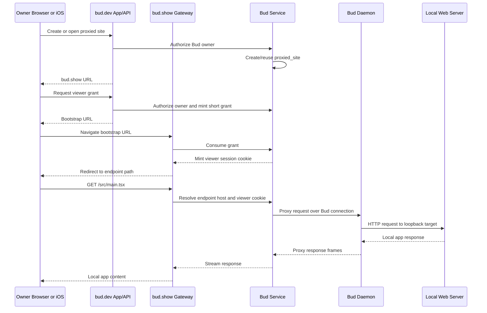

# Plan: Web Proxy Implementation

## Context

Bud already has the lower-level transport foundation for routing host-machine
content through the daemon. File serving proved the daemon can safely expose
host-local resources through service-mediated product surfaces. Web serving now
needs to turn that plumbing into a browser-correct product feature for local
development and future agent-created web UIs.

Related design docs:

- `design/web-serving-productization-plan.md`
- `design/web-serving-preview-domain-architecture.md`
- `design/network-upgrade-web-serving-productization.md`
- `design/network-upgrade-quic-transport.md`
- `design/network-upgrade-file-serving-productization.md`

Related plan docs:

- `plan/web-proxy/phase-1-proxied-site-resource-and-product-routes.md`
- `plan/web-proxy/phase-2-proxy-domain-gateway-and-private-auth.md`
- `plan/web-proxy/phase-3-web-and-mobile-client-surfaces.md`
- `plan/web-proxy/phase-4-http-fidelity-request-bodies-and-cookies.md`
- `plan/web-proxy/phase-5-websocket-hmr.md`
- `plan/web-proxy/phase-5-prep-observability-and-hardening.md`
- `plan/web-proxy/phase-5a-protocol-and-daemon-websocket-bridge.md`
- `plan/web-proxy/phase-5b-gateway-upgrade-and-browser-bridge.md`
- `plan/web-proxy/phase-5c-vite-hmr-validation-and-product-hardening.md`
- `plan/web-proxy/phase-5d-websocket-regression-and-failure-states.md`
- `plan/web-proxy/phase-6-agent-tools-and-generated-ui.md`
- `plan/web-proxy/phase-7-sharing-gateway-extraction-and-transport.md`
- `plan/web-proxy/phase-8-local-https-dev.md`
- `plan/web-proxy/phase-8a-ios-safari-test-domain-dns.md`

## Objective

Authenticated Bud owners can create and manage long-lived proxied sites that
point at loopback web servers on the Bud daemon host. A proxied site can be
opened in the web workbench, opened in the iOS client, attached to multiple
threads over time, and bookmarked through a stable `bud.show` endpoint while
the Bud remains connected.

The first complete product target is:

- Owner creates or reuses a proxied site for `127.0.0.1`, `::1`, or
  `localhost` plus a port/path.
- Service creates a durable Bud-owned record with a generated-friendly
  endpoint host.
- Owner opens `https://<endpoint>.bud.show/*` from web or mobile.
- The gateway authenticates the viewer with cookie-backed hosted auth, then
  proxies traffic through the active daemon to the local target.
- The web workbench can attach/detach a thread's active web view without
  owning the proxied-site lifecycle.
- The agent has a product-level `web_view` tool that opens/closes thread views
  without granting raw proxy-session authority.

## Fixed Decisions

### Domain And Origin Model

- App/API/auth origin: `bud.dev`.
- Proxied local-app origin: `bud.show`.
- Endpoint shape: `https://<endpoint_host>.bud.show/*`.
- First local development shape: `http://<endpoint_id>.proxy.localhost:3000/*`
  with `http://<endpoint_id>.127.0.0.1.nip.io:3000/*` as a fallback when
  wildcard localhost behavior is unavailable.
- Proxied content must not share an origin with the Bud app or API.

### Resource Model

- The durable object is `proxied_site`, not `preview_session`.
- A proxied site belongs to a Bud and owner, not to a thread.
- A thread may attach to one proxied site as its current web view.
- Multiple threads may attach to the same proxied site.
- Multiple proxied sites may exist for one Bud.
- First access policy is private owner-only.

### Lifetime

- Private proxied sites use a long soft TTL, initially 90 days.
- TTL renews while the Bud is active and the site remains enabled.
- Owner access should also opportunistically renew a site if the Bud is active.
- Expiry disables or archives the site but does not hard-delete audit history.

### Auth

- `bud.dev` authenticates the owner with the existing Better Auth session.
- `bud.show` uses a proxy viewer cookie minted by a short-lived authenticated
  bootstrap flow.
- Viewer cookie lifetime matches Better Auth defaults: 7-day max age, with a
  roughly 1-day refresh/update window while the owner remains authenticated.
- Mobile and browser iframe navigation must not require arbitrary bearer
  headers.
- If third-party cookie behavior blocks embedded private access, the UI falls
  back to opening the proxied site in a top-level tab/window.

### Target Policy

- First target hosts: exact `127.0.0.1`, `::1`, and `localhost`.
- The daemon revalidates every resolved address as loopback at request time.
- Arbitrary hostnames, LAN addresses, metadata service IPs, Unix sockets, and
  file paths are out of scope.
- Default upstream `Host` header is the target host/port for dev-server
  compatibility.

### Cookie Policy

- Do not forward `bud.dev` cookies to local apps.
- Allow endpoint-host local app cookies because many local apps rely on cookie
  state.
- Reserve gateway auth cookie names and prevent local apps from overwriting
  them.
- Strip or rewrite upstream `Set-Cookie` `Domain` attributes so local app
  cookies remain endpoint-host scoped.
- Cap local-app cookie count and size to protect gateway resources.

### Deployment

- Start with a co-located gateway in the service process.
- Do not extract a separate gateway until traffic volume, operational scaling,
  or security review requires it.
- Save full local HTTPS setup for a future pass. HTTP-only local development is
  acceptable for the first implementation.

## Target Architecture



## Product API Contracts

First-pass REST routes should use `snake_case` request and response fields at
the boundary.

```http
POST   /api/buds/:bud_id/proxied-sites
GET    /api/buds/:bud_id/proxied-sites
GET    /api/proxied-sites/:proxied_site_id
PATCH  /api/proxied-sites/:proxied_site_id
DELETE /api/proxied-sites/:proxied_site_id

POST   /api/threads/:thread_id/web-view/attach
DELETE /api/threads/:thread_id/web-view

POST   /api/proxied-sites/:proxied_site_id/viewer-grants
```

Representative create request:

```json
{
  "target_host": "127.0.0.1",
  "target_port": 5173,
  "path": "/",
  "title": "Vite app",
  "reuse_existing": true,
  "source": "manual",
  "access_policy": "private_owner"
}
```

Representative response:

```json
{
  "proxied_site_id": "01J...",
  "bud_id": "01J...",
  "created_by_user_id": "01J...",
  "display_name": "Vite app",
  "target_host": "127.0.0.1",
  "target_port": 5173,
  "path": "/",
  "endpoint_host": "vite-dev-a8f2.bud.show",
  "view_url": "https://vite-dev-a8f2.bud.show/",
  "access_policy": "private_owner",
  "enabled": true,
  "expires_at": "2026-08-10T00:00:00.000Z",
  "transport": {
    "http": true,
    "request_bodies": false,
    "websocket": false
  }
}
```

## Data Model

### `proxied_site`

Durable Bud-owned local web target.

- `id` ULID primary key.
- `tenant_id` nullable for current tenancy conventions.
- `bud_id` required.
- `created_by_user_id` required.
- `display_name` required.
- `slug` required generated-friendly identity without domain suffix.
- `endpoint_host` required unique host, for example
  `vite-dev-a8f2.bud.show`.
- `target_scheme` default `http`.
- `target_host` required, constrained by service validation and daemon
  validation.
- `target_port` required.
- `default_path` default `/`.
- `access_policy` default `private_owner`.
- `enabled` default true.
- `disabled_at`, `disabled_by_user_id`.
- `expires_at` for soft lifecycle.
- `last_accessed_at`, `last_renewed_at`.
- `last_daemon_seen_at` or derived from Bud connection state.
- `created_at`, `updated_at`.

Indexes:

- `(bud_id, created_by_user_id)`.
- unique `(endpoint_host)`.
- optional unique reuse key on `(bud_id, target_host, target_port,
  default_path)` when `reuse_existing` is true.
- `(expires_at)` for renewal/disable sweeps.

### `thread_web_view`

Current web-view attachment for a thread.

- `thread_id` primary key.
- `tenant_id` nullable.
- `bud_id` required.
- `proxied_site_id` required.
- `created_by_user_id` required.
- `selected_path` optional.
- `attached_by_user_id` nullable when attached by assistant/tool on behalf of
  thread owner.
- `created_at`, `updated_at`.

The service must authorize the thread first, then verify the proxied site
belongs to the same owner and Bud before attaching.

### `proxied_site_viewer_grant`

Short-lived bootstrap authorization created from `bud.dev` for `bud.show`.

- `id` ULID primary key.
- `proxied_site_id`, `bud_id`, `user_id`.
- `grant_hash` required.
- `redirect_path` required.
- `expires_at` short duration, for example 2-5 minutes.
- `consumed_at`.
- `created_at`.

### `proxied_site_viewer_session`

Opaque server-side viewer cookie state for private owner access.

- `id` ULID primary key.
- `proxied_site_id`, `bud_id`, `user_id`.
- `token_hash` required.
- `auth_session_id` nullable link to the Better Auth session when available.
- `expires_at` default 7 days from mint/refresh.
- `last_seen_at`, `last_refreshed_at`.
- `revoked_at`.
- `created_at`.

The gateway should validate the viewer session before opening a daemon proxy
stream and refresh the expiry when the Better Auth session is still valid and
the update window has elapsed.

## Phase Sequence

| Phase | Outcome | Product Capability |
| --- | --- | --- |
| 1 | Durable resource and owner-scoped routes | Users can create/list/update/disable proxied-site records and attach them to threads. |
| 2 | Private `bud.show` gateway | Owner can load simple `GET`/`HEAD` local web pages through endpoint hosts. |
| 3 | Web and mobile surfaces | Workbench and iOS can open sites, recover from auth restrictions, and manage attachments. |
| 4 | HTTP fidelity | Forms, mutation APIs, redirects, local app cookies, and larger app assets work. |
| 4a | Methods, bodies, and cancellation | Common mutation APIs work with bounded request bodies while cookies/redirects remain deferred. |
| 5 Prep | Observability and hardening | Current HTTP proxy reset/auth behavior is diagnosable before WebSocket support expands the protocol surface. |
| 5a | Protocol and daemon WS bridge | Service and daemon can open and exchange messages with local loopback WebSocket targets. |
| 5b | Gateway/browser WS bridge | Authorized endpoint-host browser WebSockets bridge to daemon WebSocket sessions. |
| 5c | Vite HMR validation | Vite-style HMR works through the proxy endpoint host. |
| 5d | WebSocket regression and failure states | Echo/lifecycle regressions are covered and web/agent surfaces show useful failure states. |
| 6 | Agent tools and generated UI | The assistant can open/reuse/detach web views as a product-level capability. |
| 7 | Expansion path | Sharing, friendly slugs, gateway extraction, HTTP/3, and local HTTPS have a concrete path. |
| 8 | Local HTTPS dev | mkcert+Caddy parity profile validates secure cookies, app/API routing, and proxy endpoint hosts locally. |
| 8a | iOS-safe local proxy DNS | Local HTTPS proxy endpoint hosts move from wildcard `.localhost` to dnsmasq-backed `.test` for Safari/WKWebView compatibility. |

Current execution note: Vite HMR is now validated through the Phase 5
WebSocket path, so Phase 4a is the next HTTP-fidelity slice: mutation methods,
bounded request bodies, and cancellation. Cookies, redirects, and any larger
streaming-upload protocol remain follow-up Phase 4 work.

## Rollout Strategy

1. Ship Phase 1 behind service-only feature flags or internal API access.
2. Enable Phase 2 for internal/dev Bud owners with private access only.
3. Add web and iOS client surfaces in Phase 3, still private owner-only.
4. Increase fidelity with the split Phase 5 WebSocket/HMR path first, using
   Vite as the first full-fidelity acceptance target.
5. Lock in WebSocket/HMR with Phase 5d regression coverage and product-visible
   failure states.
6. Land Phase 4a HTTP mutation methods, bounded bodies, and cancellation after
   HMR is stable.
7. Expose agent tools after product routes and client fallback behavior are
   reliable enough that the assistant does not strand users in broken iframes.
8. Defer public sharing, password protection, and separate gateway deployment
   until private owner proxying is stable.

## Impacted Contracts

- [x] DB schema: new proxied site, thread attachment, viewer grant/session
  tables.
- [x] Browser-facing REST routes: new Bud/thread/proxied-site APIs.
- [x] Bud-service protocol: new HTTP body and WebSocket proxy frames in later
  phases.
- [x] SSE events: proxied-site lifecycle and thread web-view attachment events.
- [x] Agent tools: `web_view.open`, `web_view.close`, `web_view.list`.
- [x] Web UI: web-view pane, site picker, fallback states.
- [x] iOS client: hosted URL bootstrap and top-level web-view opening.

## Security Invariants

- Resolve authenticated viewer before reading or streaming proxied-site data.
- Return `401` only for unauthenticated browser/API requests.
- Return `404` for signed-in non-owners.
- Do not attach gateway listeners, daemon streams, or WebSocket bridges before
  authorization succeeds.
- Never trust raw `bud_id`, `thread_id`, `proxied_site_id`, or endpoint host
  without ownership-aware lookup.
- Never forward Bud app credentials to a local app.
- Never allow local target selection outside daemon-validated loopback hosts.
- Disable proxy traffic immediately when a site is disabled, expired, deleted,
  or the daemon disconnects.

## Definition Of Done

- Each implementation phase updates the specs for touched source folders.
- Database phases include local `db:push`, checked-in Drizzle migrations, and
  migration spec updates.
- Protocol changes update `docs/proto.md`.
- Browser-facing routes include multi-user ownership tests.
- Gateway and daemon proxy flows include security tests for auth-before-stream,
  cookie/header filtering, disabled sites, daemon disconnects, and target
  validation.
- Web and iOS clients have explicit fallback behavior for private iframe auth
  failures.
- The progress and validation checklists in this folder are updated as phases
  land.
