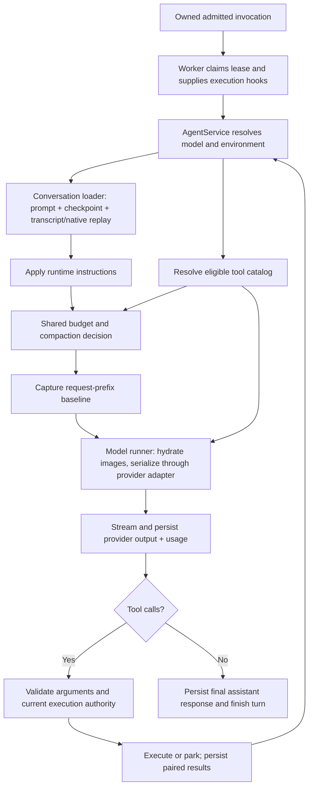

# Review: Agent tool selection and context building

Date: 2026-09-16. Scope: current `feat/bud-owned-browser` working tree, including
the provider-accounting implementation and browser-catalog regression fix.
This is a review, not authorization for another refactor.

## Main finding

The model receives **messages and tool definitions as separate request inputs**.
A tool mentioned in the system prompt is not necessarily in the advertised tool
list. Tool selection is dynamic and occurs before every normal model step.

The regression was in that selection step, not in Chrome, browser observations,
provider token counting, or the model deciding to ignore an available tool.
The shared catalog assembled a browser context without the invocation identity;
the old broker availability predicate returned false; the catalog consequently
omitted every browser tool. Public web retrieval had a separate availability gate
and remained usable.

The architecture needs three distinct decisions:

1. What capabilities exist for this owned Bud/thread?
2. Which tools can this execution path offer to the model?
3. Is this particular call authorized to execute **now**?

Only the third decision can authorize side effects. The original availability
predicate combined parts of the first two; reusing it for an idle context preview
made that implicit coupling fail.

## What “context” means here

| Object | Contents | Owner / purpose |
| --- | --- | --- |
| Model conversation (`CanonicalMessage[]`) | Prompt, checkpoint replacement history, visible user input, assistant/native replay, tool results | Conversation loader + agent loop; content supplied to the provider |
| Tool catalog (`CanonicalTool[]`) | Names, descriptions, JSON schemas | Tool definitions + service eligibility resolution; functions advertised in the provider request |
| Environment snapshot | Bud ID, online/offline mode, coarse terminal/web-view availability | Service transport state; request preparation and UI |
| Execution hooks | Invocation ID, worker ID, fence, checkpoints, action recording and durable parking callbacks | Invocation worker; internal execution authority and lifecycle |
| Browser execution context | Thread/Bud/owner/turn, abort signal, invocation, later call identity | Executor/broker/repository; validates and dispatches browser operations |
| Context budget | Primary estimated usage, provenance, approximate category composition | Shared accounting; meter and compaction decisions |

An **invocation** is a durable unit of agent work, not a browser tab or an LLM
request. A turn can make multiple provider requests and tool calls under it.
The worker ID identifies the executor; the fence prevents an obsolete worker from
continuing after recovery/reassignment. The browser repository checks these
against the current DB lease. None is model-supplied.

Sources: [execution hooks](../service/src/agent/execution-lifecycle.ts),
[worker](../service/src/agent/invocation-worker.ts),
[invocation executor](../service/src/agent/invocation-executor.ts).

## Request-building flow



The loop retains its working conversation in memory; the diagram's return to
request preparation does not mean every step reloads all history. Reconstruction
happens initially and after compaction, while ordinary tool outputs are appended.

### Conversation reconstruction

[AgentConversationLoader](../service/src/agent/conversation-loader.ts):

- Seeds the current prompt via [system-prompt.ts](../service/src/agent/system-prompt.ts).
  Today it is the default Markdown file with a content-hash version; it is not
  automatically rewritten to enumerate the current tool catalog.
- Adds the latest completed checkpoint's replacement history, removing its old
  system messages, then loads only model-visible history after the checkpoint.
- Uses same-provider ledger output where compatible; avoids duplicating the
  assistant display rows already represented in that ledger.
- Preserves provider-native reasoning where supported. Display-only reasoning and
  compaction rows do not become model input a second time.
- Reconstructs tool-use/result pairs and repairs orphaned calls with an explicit
  interrupted/unknown result. Repair never re-executes the historical call.
- Emits parallel provenance for the model-view endpoint. That provenance is not
  a second conversation or an authorization grant.

[Environment helpers](../service/src/agent/environment.ts) insert the offline
instruction after the base prompt. Online mode currently adds no such instruction.
The environment's `tools` object is coarse; it does **not** enumerate browser,
retrieval, approval or automation eligibility.

### Catalog construction

[AgentService.getContextTools](../service/src/agent/agent-service.ts) resolves
eligibility and passes flags to
[resolveAgentToolsForEnvironment](../service/src/agent/tool-definitions.ts).
That latter function selects static schemas; it does not execute tools.

| Family | Current catalog gate |
| --- | --- |
| Personal-data query tools | Included in the base catalog; actual data access is checked at execution |
| Terminal and local web-view tools | Base catalog, filtered out in Bud-offline mode |
| `ask_user_questions` | Base catalog; remains available offline |
| `web_search` / `web_read` | Retrieval configuration/provider availability, independent of browser availability |
| Browser open/observe/act/close | Eligible durable execution/preview, owner, normal environment, configured executor, live capable carrier |
| Browser handoff | Browser eligibility plus handoff-capable carrier and thread browser state allowing handoff |
| App-data permission request | Service enablement plus live parking hook; idle preview uses durable configuration |
| Automation management / reviews | Service enablement plus required live execution/parking hooks; idle preview uses durable configuration |

A running turn supplies actual hooks. An idle meter/model-view request has no
running invocation and uses the configured durable path to preview eligibility.
These are different inputs even though they share the catalog builder.

[Browser schemas](../service/src/agent/browser-tools.ts) separately distinguish
Bud-owned live browsing, public retrieval, and local app previews. Advertising a
tool does not force the model to choose it. Conversely, text in the prompt cannot
make a missing function callable through the normal advertised interface.

### Provider boundary and results

[AgentModelRunner](../service/src/agent/model-runner.ts) accepts messages and tools,
resolves provider/model settings, hydrates permitted browser image references,
and passes those inputs to the adapter. Adapters translate canonical content and
schemas into their provider format. Browser images are loaded just before the
call; durable JSON holds references rather than image bytes.

[AgentService](../service/src/agent/agent-service.ts) records completed output and
usage in the [provider ledger](../service/src/llm/provider-ledger.ts), then executes
the returned tool directives through their respective executors. Worker hooks
checkpoint the lease and record action intent. Tool results are persisted and
added to the next model request. Human approval/control can durably park work.

Tool availability can change after request creation. Execution must therefore
recheck authority and report disconnection, changed control, invalid arguments or
uncertain outcomes truthfully. An advertised catalog is not an authorization cache.

## Exact regression and current fix

Before the refactor, the loop constructed browser context with:

```ts
invocation: args.executionHooks?.invocation
```

The old broker predicate was effectively:

```ts
return Boolean(context.invocation && browserCarrier(context.budId));
```

The new shared `getContextTools` initially passed thread/Bud/owner/signal but no
invocation. The result was:

```text
missing invocation
  -> available() returns false
  -> options.browser = false
  -> browser schemas omitted from tools[]
  -> provider receives web retrieval tools but no browser tools
```

In thread `32ae526b-b0bc-4480-a953-590a624a4055`, the user explicitly asked to open
Hacker News in the browser. The first assistant message said interactive browser
control was unavailable; the recorded calls were web_search and web_read, with no
browser attempt. This matches the deterministic omission above. Only this supplied
thread was inspected; the other two reported attempts were not separately queried.

The fix now:

- Forwards actual invocation context when hooks exist.
- Gates live catalog eligibility on the presence of a real invocation; idle preview
  eligibility uses durable service configuration rather than fabricating an identity.
- Makes broker availability a capability/state lookup rather than an invocation
  existence check.
- Leaves executor owner validation and repository dispatch authorization in place.

[BrowserToolExecutor](../service/src/agent/browser-tool-executor.ts) authorizes the
owned thread/Bud before discovery or execution.
[BrowserRepository.prepare](../service/src/browser/repository.ts) still requires
a real invocation and validates running status, worker/fence/turn, lease expiry,
cancellation, owner/thread/Bud and action receipt before preparing a command.
Daemon-side session/generation/epoch checks remain additional fences.

No permission was moved into the model, and meter reads cannot dispatch browser
commands. See [debug note](../debug/browser-tool-catalog-invocation-regression.md).

## Accounting and the browser-visible model view

[context-accounting.ts](../service/src/agent/context-accounting.ts) freezes a small
identity/prefix digest before the call. Completed usage and that baseline are
stored together. The next budget decision uses compatible provider input plus
estimated appended canonical content, or the complete heuristic fallback.
Changing the tools invalidates the anchor because tool schemas consume input too.

[context-budget-state.ts](../service/src/agent/context-budget-state.ts) supplies
both compaction and primary utilization. Estimated category composition has its
own denominator and need not sum to provider-anchored usage.

The authorized [agent-state route](../service/src/routes/threads/agent.ts) prefers
the active runtime budget decision; otherwise it reconstructs via
[context-budget-snapshot.ts](../service/src/agent/context-budget-snapshot.ts).
The [model-context route](../service/src/routes/threads/model-context.ts) shows
reconstructed messages, provenance and a currently resolved catalog. It is not a
saved, byte-exact copy of the last provider request. Its per-message/top-level
counts are heuristic composition; nested `context_budget` is primary usage.

Browser image hydration and unsupported generic-provider serialization use the
fallback. Strict prefix checking can also reject a legitimate history reconstructed
in a different grouping. Those are deliberate conservative limits, not evidence
that the provider reported incorrect usage.

## Review findings and bounded follow-ups

### 1. Fixed: discovery depended on execution identity

This was the immediate regression. Keep capability discovery and dispatch authority
separate. Do not repair idle accounting by inventing a worker/fence or weakening
repository checks. The new regression test uses the real broker with a capable
carrier and verifies live/idle catalog parity plus legacy/offline/unavailable cases.
It checks that discovery sends no commands. Owner authorization is injected in that
fixture; it is not a substitute for repository authorization tests.

### 2. Remaining: preview versus execution is implicit in optional hooks

`getContextTools(..., hooks?)` uses missing hooks to mean an idle preview. That is
compact but easy to misuse. If this surface is touched again, prefer an explicit
preview/execution input with only the eligibility facts needed by the catalog.
Do not introduce another tool registry or a generic permissions engine.

### 3. Remaining: shared helpers are not one atomic request preparation

Pre-turn compaction, each model step and idle reconstruction resolve inputs at
different times. Mid-turn compaction uses the preceding step's tools/environment;
the next iteration refreshes environment and tools before invocation. Capability
or control changes can therefore make a budget decision older than the request.
Prefix identity validation protects reuse of old measured counts; it does not make
these observations atomic. A future narrow improvement is to calculate a step's
messages/tools/budget from the same prepared inputs, without caching authority.

### 4. Remaining: unavailable-tool reasons are not surfaced by the catalog

Booleans distinguish available/unavailable but not offline, unsupported carrier,
missing durable path or missing executor. The coarse environment snapshot cannot
explain browser-specific absence. For investigations, bounded tool names and reason
codes would be more useful than full prompt dumps. This review does not add logging
or persist full requests. Existing prompt-drift diagnostics are opt-in and can
contain much more data than is needed to diagnose catalog omission.

### 5. Necessary complexity versus avoidable complexity

Keep the durable lease/action lifecycle, owner checks, provider replay, private
browser control and execution-time revalidation: they protect real product behavior.
Avoid duplicate catalog resolution rules, fake preview invocation identities,
word-based prompt tests, and a separate token-accounting subsystem.

A small shared catalog resolver and a prepared request per model step are a more
appropriate direction than another orchestrator abstraction. The present review
identifies that direction; it does not require doing a broad rewrite now.

## Evidence and validation limits

- Read the loader, catalog, environment, hooks/worker/executor, browser broker and
  executor, accounting, and relevant request/route paths in the current checkout.
- Inspected the supplied thread read-only with thread/Bud owner matching.
- Catalog/broker regression tests and service build passed after the fix.
- Earlier accounting tests cover prefix invalidation and math; they did not compose
  the real browser broker with the shared catalog, which is why they missed this.
- A real agent browsing retry after the fix is still needed to confirm the whole
  path in the user's running environment. No new live browsing run was initiated
  for this review, and no runtime code was changed during this review.
