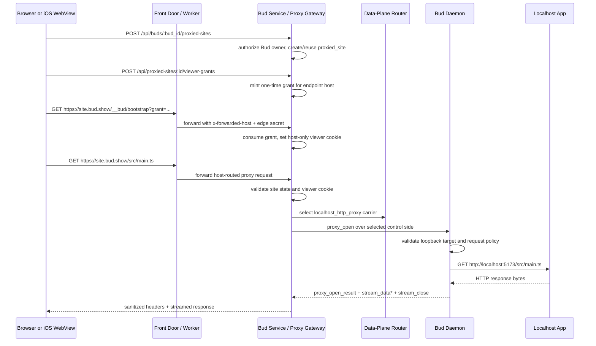

# Daemon-Service Data Plane And Web Proxy Review

Date: 2026-05-30

Reviewed:

- [`docs/proto.md`](../docs/proto.md)
- [`service/src/proxy/`](../service/src/proxy/)
- [`service/src/routes/proxy.ts`](../service/src/routes/proxy.ts)
- [`service/src/routes/proxied-sites.ts`](../service/src/routes/proxied-sites.ts)
- [`service/src/transport/`](../service/src/transport/)
- [`service/src/ws/bud-connection.ts`](../service/src/ws/bud-connection.ts)
- [`service/src/grpc/`](../service/src/grpc/)
- [`bud/src/app.rs`](../bud/src/app.rs)
- [`bud/src/proxy/mod.rs`](../bud/src/proxy/mod.rs)
- [`bud/src/transport.rs`](../bud/src/transport.rs)
- [`deploy/cloudflare/bud-front-door-worker.js`](../deploy/cloudflare/bud-front-door-worker.js)
- [`design/web-serving-preview-domain-architecture.md`](../design/web-serving-preview-domain-architecture.md)
- [`design/network-upgrade-quic-transport.md`](../design/network-upgrade-quic-transport.md)
- [`design/render-deployment-review-and-topology-options.md`](../design/render-deployment-review-and-topology-options.md)

## Executive Summary

Bud's web proxy is a service-owned reverse tunnel from a public, browser-safe
origin to a loopback HTTP or WebSocket server on the daemon host. The browser
never talks to the daemon directly. It talks to the Bud service or the
host-routed proxy gateway; the service authorizes the viewer, selects an active
daemon data-plane carrier, asks the daemon to open a local loopback request,
then streams the daemon's response back to the browser.

Today the control plane and most data-plane traffic are deliberately mixed on
the authenticated binary `BudEnvelope` WebSocket carrier. Optional HTTP/2 gRPC
control and data carriers exist, but WebSocket remains the correctness
baseline. QUIC/HTTP3 is represented in carrier policy and design docs, but
there is no implemented QUIC data carrier, token issuer, or QUIC gateway.

For production, the important split is logical, not just process-level:

- The central service owns product authority: users, Bud ownership,
  `proxied_site` lifecycle, thread attachments, viewer grants/sessions,
  operation/stream/audit rows, and agent tools.
- The data-plane gateway can be extracted only if it can still enforce that
  authority before daemon work starts and can route to the process or gateway
  that owns the live daemon carrier.
- A future QUIC/HTTP3 carrier must terminate at a component Bud controls. A
  provider that terminates HTTP3 at its load balancer and forwards HTTP/1.1 or
  HTTP/2 to the hosted app does not give the daemon an end-to-end QUIC data
  path to the Bud carrier runtime.

## Current High-Level Flow

The product web-proxy path is the durable `proxied_site` gateway, not the older
path-prefix `/api/proxy/:proxy_session_id/*` surface. The path-prefix proxy
still exists as a short-lived internal/testing-compatible surface, but it has
poor browser-origin behavior for real local web apps.



The same endpoint-host gateway also handles browser WebSocket upgrades for HMR:
the service validates the endpoint-host viewer cookie, selects a
`localhost_websocket_proxy` carrier, sends `proxy_ws_open` to the daemon, then
bridges browser and local WebSocket text/binary messages through
`proxy_ws_message`.

## Plane Definitions

Control plane:

- daemon authentication and challenge-response
- heartbeats, reconnect reports, device/transport session registration
- operation offers such as `proxy_open`, `file_open`, `terminal_ensure`
- open results such as `proxy_open_result`, `file_open_result`
- drain/offline/fallback decisions

Data plane:

- generic byte streams: `stream_data`, `stream_credit`, `stream_reset`,
  `stream_close`
- web proxy HTTP response bytes and bounded request-body bytes
- file-session read/range bytes
- terminal output when the optional gRPC data carrier is attached
- proxied WebSocket messages through the message-oriented `proxy_ws_*` frame
  family

Current carriers:

| Carrier | Role | Current Use |
| --- | --- | --- |
| WebSocket binary `BudEnvelope` | Control + data baseline | Required active baseline for daemon control, terminal, file/proxy byte streams, and proxied WebSocket/HMR. |
| HTTP/2 gRPC control | Optional control carrier | `BudControl.Connect`; selected by `DAEMON_TRANSPORT_POLICY` when enabled and healthy. |
| HTTP/2 gRPC data | Optional subordinate data carrier | `BudData.Attach`; currently negotiates `terminal_output`, `localhost_http_proxy`, and `file_read`. |
| QUIC / HTTP3 | Future data carrier | Policy placeholder only. No token issuance, attach path, runtime tracker, or gateway implementation exists. |

One current asymmetry matters for production planning: daemon WebSocket proxy
support is advertised only in WebSocket mode. The daemon's gRPC data attach
currently negotiates `localhost_http_proxy` and `file_read`, but not
`localhost_websocket_proxy`. HMR therefore still depends on the WebSocket
carrier today.

## Product Surfaces

### Short-Lived Proxy Sessions

`proxy_session` is the older, path-prefix surface:

- create/list/read/revoke through `/api/buds/:budId/proxy-sessions` and
  `/api/proxy-sessions/:proxySessionId`
- traffic through `/api/proxy/:proxySessionId/*`
- owner-scoped, Bud-scoped, short TTL, revocable
- supports common HTTP methods with bounded request bodies
- does not forward cookies to the local app

This is useful infrastructure, but it is not the durable product URL model.
Root-absolute browser paths such as `/@vite/client` do not naturally stay under
`/api/proxy/:id/*`.

### Durable Proxied Sites

`proxied_site` is the product web-proxy resource:

- belongs to a Bud and owner, not to a thread
- can be attached to one or more threads through `thread_web_view`
- has a generated endpoint host such as `vite-app-abc123.bud.show`
- defaults to target host `localhost`, target scheme `http`, private-owner
  access, enabled state, and a renewable 90-day soft TTL
- stores loopback target host/port/path, display metadata, operation/stream
  pointers, and audit correlation id

Private access uses a two-step host-auth model:

1. The authenticated Bud app/API origin mints a short-lived viewer grant for an
   owned proxied site.
2. The endpoint host consumes the grant at `/__bud/bootstrap`, sets a host-only
   `HttpOnly` viewer cookie, and redirects to the clean local-app path.

This is why the proxy can support normal browser subresources and WebSockets:
after bootstrap, the browser can load `https://site.bud.show/*` without custom
headers.

## Service Sub-Components

### Host Routing And Front Door

Local development uses generated hosts under `*.proxy.localhost`. Production is
designed around wildcard hosts such as `*.bud.show`.

The Cloudflare Worker is a thin front door:

- forwards service-owned paths such as `/api/*`, `/.well-known/*`, `/ws`,
  `/readyz`, and `/healthz` to `bud-service`
- forwards `*.bud.show/*` to `bud-service`
- preserves `x-forwarded-host`, `x-forwarded-proto`, and `x-forwarded-port`
- attaches `x-bud-edge-secret` when configured

The service trusts `x-forwarded-host` for proxy gateway routing only when the
edge secret matches. Direct host headers are accepted when they are already a
configured proxy gateway host.

### Product Auth And Resource Lookup

The API routes use normal Bud browser auth:

- Bud-scoped proxied-site routes call `requireViewer(...)` and
  `getAuthorizedBud(...)`
- proxied-site mutations filter by `proxied_site.created_by_user_id`
- thread web-view attachment authorizes the thread first, then verifies the
  proxied site belongs to the same owner and Bud
- viewer grants can be minted only by the owning user

The endpoint-host gateway does not use arbitrary browser headers for auth. It
resolves the endpoint host to a `proxied_site`, validates enabled/expiry state,
then validates the host-only viewer cookie before allocating daemon operation
or stream rows.

### HTTP Proxy Edge

`service/src/proxy/proxy-edge.ts` adapts one browser HTTP request into one
daemon `proxy_open` stream.

Responsibilities:

- authorize before daemon work
- enforce allowed methods
- buffer non-GET/HEAD request bodies under
  `PROXY_SESSION_MAX_REQUEST_BODY_BYTES`
- filter browser request headers
- forward endpoint-host local-app cookies only for durable proxied sites, after
  stripping Bud proxy viewer cookies and reserved proxy cookie names
- select the current `localhost_http_proxy` carrier
- create `bud_operation` and `bud_stream` rows
- register in-memory runtime callbacks for stream bytes, resets, and close
- send `proxy_open` plus optional same-stream request body chunks
- wait for `proxy_open_result`
- emit sanitized response headers and filtered local-app `Set-Cookie` values
- stream the daemon body into the Fastify reply
- reset daemon work on browser close, open timeout, idle timeout, TTL, service
  byte-limit failures, or transport loss

Current fidelity limits:

- request uploads are buffered, not streamed end-to-end
- response headers are allowlisted
- redirects are not rewritten yet
- local-app `Set-Cookie` is supported only on endpoint-host proxied sites
- upstream `Host` is not manually rewritten by the service; the daemon's local
  HTTP client naturally targets the loopback host/port

### WebSocket Proxy Edge

`service/src/proxy/proxy-ws-edge.ts` handles endpoint-host browser WebSocket
upgrades for durable proxied sites.

Responsibilities:

- validate the same endpoint-host viewer cookie before daemon allocation
- enforce per-site and per-Bud active WebSocket limits
- create durable operation/stream rows
- sanitize requested subprotocol tokens
- send `proxy_ws_open` to the daemon
- buffer a small number of browser messages that arrive before daemon accept
- bridge browser text/binary frames to daemon `proxy_ws_message`
- forward daemon `proxy_ws_message`, `proxy_ws_close`, and `proxy_ws_error`
  frames back to the browser socket
- close sockets on idle timeout, site expiry/disable, daemon rejection, or
  carrier loss

The service currently may select a safe browser-requested subprotocol before
the daemon local open completes. Full browser/local selected-subprotocol parity
is still called out as follow-up work.

### Data-Plane Router And Runtime

`service/src/transport/data-plane-router.ts` is the service-side abstraction
that keeps proxy/file routes from hard-coding WebSocket or gRPC.

It owns:

- active data-plane session trackers keyed by Bud, device session, and
  transport kind
- explicit carrier policy ordering:
  - `websocket_baseline`: WebSocket, H2 data, QUIC
  - `h2_preferred`: H2 data, WebSocket, QUIC
  - `quic_preferred`: QUIC, H2 data, WebSocket
- health normalization and demotion of unhealthy carriers
- negotiated stream-family checks
- runtime stream receive/send offsets and credits
- per-stream ordered dispatch for data, credit, reset, and close frames
- per-Bud stream-capacity checks
- final-offset validation
- transport-loss cleanup and audit events

For HTTP proxy streams, bytes move over generic stream frames. For WebSocket
proxy sessions, the runtime registers a marker stream so transport finalization
can clean up browser sockets, while actual WebSocket payloads use the
message-oriented `proxy_ws_*` frame family.

### Durable Operation, Stream, And Audit State

Each proxied HTTP request and proxied WebSocket session creates durable
`bud_operation` and `bud_stream` rows before the daemon is asked to do work.
Those rows record operation type, traffic class, selected device/transport
session ids, stream state, reset reasons, typed errors, and outcomes.

`audit_event` records security-sensitive decisions such as session/site create,
stream open, service-side denial, daemon rejection, reset, and close metadata.
The durable rows are not a full in-flight resume system yet; live stream
delivery still depends on in-memory runtime maps in the service instance that
owns the carrier.

## Daemon Sub-Components

### Transport Sender

`bud/src/transport.rs` is the daemon-side send boundary. It can wrap:

- the active WebSocket writer
- a gRPC control sender
- an optional gRPC data sender

For WebSocket, it sends protobuf `BudEnvelope` binary frames when negotiated.
For gRPC, terminal output may fall back to control if the data channel is
unavailable, but generic stream frames are data-required and fail if no data
channel is attached.

### App Dispatcher And Capabilities

`bud/src/app.rs` dispatches service frames to terminal, proxy, and file
managers. It advertises capabilities in `hello`:

- `bud_envelope.websocket_binary`
- `bud_envelope.stream_frames`
- `proxy.localhost_http`
- `proxy.localhost_websocket` only in WebSocket mode
- loopback proxy target hosts and common HTTP methods
- file read/resolve support

On transport shutdown the app cancels active proxy/file work so local requests
do not continue after the service-side carrier disappears.

### Local HTTP Adapter

`bud/src/proxy/mod.rs` handles `proxy_open`.

Daemon policy is intentionally redundant with service policy:

- only `stream_type = "localhost_http_proxy"`
- only `127.0.0.1`, `::1`, or exact `localhost`
- `localhost` is resolved at request time and every resolved address must be
  loopback
- only `GET`, `HEAD`, `POST`, `PUT`, `PATCH`, `DELETE`, and `OPTIONS`
- path must be absolute
- redirects are disabled in the daemon's `reqwest` client
- request headers are allowlisted
- request bodies are bounded and must match declared offsets/length
- response headers and raw `Set-Cookie` values are sent back for service-side
  filtering
- response body chunks respect negotiated max chunk size and stream credit

The daemon sends:

- `proxy_open_result accepted:false` for policy/local open failures
- `proxy_open_result accepted:true` with status, headers, and optional
  `set_cookies`
- `stream_data` chunks with monotonic offsets
- `stream_close` with final offset
- `stream_reset` for local read/protocol errors

### Local WebSocket Adapter

The daemon handles `proxy_ws_open` by dialing
`ws://<loopback-host>:<port><path>`.

It validates loopback target policy, forwards safe requested subprotocols,
bridges text and binary frames, handles ping/pong locally, sends daemon-side
close/error frames to the service, and tears down sessions on service reset or
transport disconnect.

## Relationship To File Sessions

The web proxy does not read static files from the daemon filesystem. For web
assets, the daemon makes local HTTP requests to the user's dev server, and the
dev server decides which files to serve.

Bud also has a separate `file_session` product surface:

- user-clicked file preview/read/range
- daemon `file_resolve` and `file_open`
- strict workspace-root policy
- content identity and range checks
- byte streaming over the same generic data-plane runtime

The two features share the transport runtime, operation/stream durability,
credits, and carrier selection, but they are different product policies.

## What Can Be Split Out

### Already Split Or Safe To Keep Separate

- Static web UI hosting can remain separate from the service.
- A front-door router such as Cloudflare Worker can remain thin and stateless,
  forwarding `/api/*`, `/ws`, and `*.bud.show/*` while preserving host context.
- PostgreSQL can remain managed and centralized.

### Proxy Gateway Extraction

The endpoint-host HTTP/WebSocket gateway can move to a separate host or VM if
it receives equivalent authority and routing primitives:

- endpoint-host lookup for `proxied_site`
- viewer grant/session validation or a signed internal validation API
- enabled/expiry/access-policy checks before daemon work
- operation/stream/audit writes or a reliable internal call to make the
  central service perform those writes
- data-plane carrier access to the Bud that owns the target
- transport-loss cleanup for active browser responses and WebSockets

Two extraction models are plausible:

1. Thin gateway: terminate `*.bud.show`, validate/normalize request context,
   then call the central service instance that owns the Bud carrier. This keeps
   daemon routing centralized but does not independently scale data movement.
2. Data gateway: gateway owns one or more daemon data carriers and exposes an
   internal control API to the central service. This scales proxy traffic but
   requires a real distributed connection registry, token binding, and shared
   stream/audit semantics.

### QUIC / HTTP3 Data Gateway

A future QUIC carrier is best thought of as a data gateway, not a product URL
change. It should carry the same `BudEnvelope` stream lifecycle and the same
proxy/file payloads behind the existing service API.

Minimum expectations:

- control session remains authoritative
- service issues short-lived QUIC tokens over the authenticated control carrier
- tokens bind Bud id, device session id, control transport session id, endpoint
  candidates, allowed stream families, and expiry
- QUIC attach registers a durable `transport_session`
- selector health can promote/demote QUIC without changing browser URLs
- fallback to WebSocket or H2 data remains a correctness requirement

Render-style HTTP3 termination at the load balancer is not enough for this
carrier if the hosted process only receives HTTP/1.1 or HTTP/2 after
termination. The daemon must be able to establish QUIC to a component that owns
or exposes Bud's data-plane stream runtime.

## What Should Remain Centralized

Even if the gateway moves, these responsibilities should remain under the
central service's authority unless a deliberate distributed-control design
replaces them:

- browser authentication and user ownership
- Bud claim/onboarding and Bud owner binding
- proxied-site create/update/disable/list
- thread web-view attachment
- viewer-grant issuance policy
- private-owner access policy
- agent `web_view` tools
- durable operation/stream/audit semantics
- carrier selection policy and health interpretation
- offline/drain/reconnect reconciliation semantics

The current service is still single-instance for correctness. Live daemon
connection trackers, data-plane runtime streams, and SSE replay buffers are
process-local. Horizontal scaling or a separate proxy gateway therefore needs a
connection-owner routing layer or a shared message/stream fabric; sticky
browser sessions are insufficient because the daemon and the browser are
different clients.

## Production Expectations

The product URL contract should stay stable:

```text
https://<endpoint>.bud.show/*
  -> Bud proxy gateway
  -> authenticated daemon data plane
  -> http://localhost:<port>/*
```

Transport choices should be invisible to browser and mobile clients. They
should see normal HTTPS/WSS endpoints, normal redirects/cookies within the
`bud.show` origin, and explicit error states when the Bud is offline or no
carrier supports the required stream family.

For a first production mode without QUIC:

- one service instance can own app/API/auth, daemon WebSocket, and proxy
  gateway
- Cloudflare or another front door can route `bud.dev` app/API paths and
  `*.bud.show` wildcard traffic to that service
- WebSocket upgrades and SSE buffering behavior must be validated
- `PROXY_EDGE_SECRET` must be configured if forwarded proxy hosts are trusted

For a production mode with QUIC:

- choose infrastructure that can deliver UDP/QUIC to the application gateway,
  or run a dedicated gateway on a VM/bare-metal/provider stack that supports it
- do not treat browser-to-edge HTTP3 as equivalent to daemon-to-service QUIC
- keep WebSocket/H2 fallback available and observable
- preserve the central service as product authority

## Current Gaps And Follow-Ups

- QUIC is not implemented. `quic_preferred` is only policy ordering until a
  QUIC tracker, token, and gateway exist.
- gRPC adapters still use transitional `frame_json` in several payload paths.
  Do not carry that debt into a QUIC product carrier.
- `localhost_websocket_proxy` currently requires the daemon WebSocket carrier;
  H2/QUIC parity for HMR is future work.
- Request uploads are buffered at the service and daemon, not streamed
  end-to-end.
- Redirect rewriting is not implemented.
- Header policy is conservative; iframe-related response header rewriting and
  alternate upstream `Host` policies are follow-up work.
- Runtime streams are process-local; durable rows support audit and outcome
  tracking, not true in-flight proxy resume.
- Per-class scheduling/fairness is still coarse. Heavy asset loads on the
  WebSocket baseline can still contend with interactive terminal traffic.
- A separate gateway will need explicit internal auth, stream routing,
  operation ownership, and cleanup contracts before horizontal scaling is safe.

## Bottom Line

Bud already has the right product shape for web proxying: browser-owned
`bud.show` URLs, service-owned auth and lifecycle, daemon-enforced loopback
policy, and carrier-neutral stream framing. The current implementation is
WebSocket-first with optional HTTP/2, not QUIC-first.

The production hosting decision should therefore evaluate which platform can
run the future data gateway Bud actually needs, not just which platform can
advertise HTTP3 to browsers. If HTTP3 terminates before Bud's gateway, it helps
the public front door but does not provide the daemon-service QUIC data plane.
